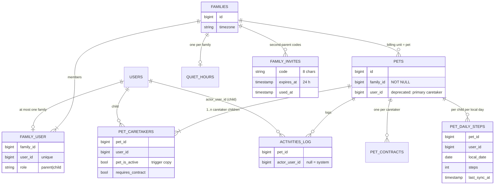

# ADR-012: Family model — several parents, several children, shared pets

- **Status:** Accepted. Product rules: David, 2026-10-04. The four implementation choices (one active pet per child, own contract per joining child, summed steps, join only from an empty account) were **confirmed by David on 2026-10-04** after PR #14.
- **Date:** 2026-10-04
- **Deciders:** David, Claude
- **Roadmap:** M2-01 (phase 1, backend). Follow-ups M2-01a…d.
- **Numbering:** ADR-001…011 live in the root `README.md`; ADR-008 there is "Zustand + TanStack Query", so this decision takes the next free number, 012. (The decision commit referred to it as "ADR-008"; references were corrected.)

## Context

The MVP was built as **1 parent → 1 child → 1 pet** (`users.parent_id`, `pets.user_id`, family timezone on the parent's `users.timezone`, PRODUCT_SPEC §3 "MVP: 1 starš → 1 otrok → 1 pes"). Real families have two parents and several children. David decided on 2026-10-04 (DECISIONS.md, PRODUCT_SPEC §3):

1. A family has several parents (e.g. mum and dad) and several children. **All parents see all children and pets** of the family.
2. Each child has their own pet, **or** several children share one pet (shared custody).
3. Shared pet: every action is attributed to the child who did it → **each child gets their own score / traffic light / certificate**.
4. Pricing is **per pet** (12-week challenge 49.99 € per pet; a shared pet is one price; the mutt stays free). Payments are not built — the model only has to make the pet the billing unit.

Constraints: current mobile builds read `users.parent_id`-based flows and single-pet payloads; production already has data (parents, children, pets, activities, contracts); the audit (AUDIT-2026-10-02) requires policies instead of ad-hoc role checks.

## Decision

### Entities

- **families** `(id, timezone default Europe/Ljubljana)` — the family timezone moves here from the parent's `users.timezone`.
- **family_user** `(family_id, user_id UNIQUE, role parent|child)` — a user belongs to at most one family.
- **pets.family_id** NOT NULL — every pet belongs to one family; the pet is the billing unit (a future `pet_entitlements` / RevenueCat entitlement hangs off `pets.id`, not off the family or a user).
- **pet_caretakers** `(pet_id, user_id, pet_is_active, requires_contract)` — which children care for a pet. A shared pet has several rows.
- **activities_log.actor_user_id** — the child who acted; null for system rows (escalation).
- **pet_daily_steps** — each child's own steps per family-local day per pet.
- **pet_contracts** unique `(pet_id, user_id)` (was `pet_id`) — one contract per caretaker child.
- **family_invites** — second-parent invite codes.
- **quiet_hours.family_id** (unique) — one quiet-hours configuration per family, any parent edits it.
- **users.pairing_pet_id** — the child PIN's target pet (null = new pet).

### Invariants

| Invariant | Enforced by |
|---|---|
| A user is in at most one family | `family_user.user_id` UNIQUE |
| A pet belongs to exactly one family | `pets.family_id` NOT NULL + FK |
| A pet has ≥ 1 caretaker | `PairingService` (creates the caretaker row in the same transaction), `Pet::created` hook for legacy writes |
| Only children are caretakers; parents never act | `FamilyService::addCaretaker` (role check), `PetPolicy::act` (child + caretaker) |
| **A child cares for at most ONE active pet at a time** (David, 2026-10-04) | `FamilyService::addCaretaker` + partial unique index `pet_caretakers_one_active_pet_per_child (user_id) WHERE pet_is_active`; `pet_is_active` is a trigger-maintained copy of `pets.is_active` (works for `saveQuietly()` and bulk updates too) |
| A child pairs once (unchanged rule) | `PairingService::pairChild` refuses a child that already has a parent / family |
| Caretakers are members of the pet's family | `FamilyService::addCaretaker` |

Why one active pet per child: the child app shows one dog (HUD, steps from one phone). A child with two dogs would need a pet switcher and an answer to "whose dog gets my steps" — not in MVP. Game over frees the child (the trigger flips `pet_is_active`), so a later "new dog after game over" flow is possible (not built; pairing still refuses an already paired child).

### Pairing flows

1. **Child, new pet** — unchanged: `POST /api/parent/generate-pin` (no body) → 6-digit PIN, 15 min → `POST /api/child/pair` creates the child's unborn pet in the parent's family; the child signs → birth (M1-07b).
2. **Child, existing pet (shared)** — `POST /api/parent/generate-pin {pet_id}`: the pet must be an active, non-game-over pet of the parent's family (else 422 `pet_not_joinable`; another family's pet is indistinguishable from a missing one). The child pairs → becomes a caretaker; **the pet is not re-born**. Any parent of the family can issue either PIN.
3. **Second parent** — `POST /api/parent/invite-parent` → 8-character code (unambiguous alphabet), 24 h, single use, a new code revokes the same parent's previous one; route throttle 10/h. `POST /api/parent/join-family {code}`: allowed only for a parent whose own family has **no children and no pets** (a fresh account) — otherwise 409 `family_not_empty`. *No merging of families (David, 2026-10-04).* 5 wrong codes per account in 15 min → 429. The joiner's old family is deleted only if nobody and nothing is left in it (re-checked under locks, see "Deletes and locking"); if another parent stays, the family stays and its quiet hours pass to that parent.
4. **PIN-only child login (M2-02)** stays a separate task: today a child still signs in with an account and then enters the PIN.

### Contracts on a shared pet (David, 2026-10-04)

The pet is **born at the first contract**. Every additional caretaker must sign **their own** contract before they can act: until then that child (only that child) gets 423 `contract_required`; the other caretakers keep playing. Re-signing by the same child → 409. Lock evaluation is per child: `Pet::actionLockReasonFor($child)` (priority unchanged: game over › inactive › hard stop › contract required › illness). Caretaker rows backfilled from pets born before contracts existed have `requires_contract = false` (grandfathered, as in M1-07b).

### Per-child attribution and scoring

- Every applied child action writes `activities_log.actor_user_id`. Feed windows and water limits stay **per pet** (the dog is fed once per window, whoever feeds it).
- **Steps (David, 2026-10-04):** steps come from the acting child's phone; each child's cumulative count is stored in `pet_daily_steps` (idempotency and anti-cheat per child). **The shared pet's daily walk goal is met by the combined steps of all caretakers that day** (`pets.daily_step_count` = sum). The `walked_pet` row goes to the child whose sync crossed the goal. `pet_daily_walks` (closed days) stays per pet.
- **Where scores are computed:** on read, from `activities_log.actor_user_id` + `pet_daily_steps` (`FamilyDashboardService`): per child, last 7 family-local days — fed, watered, cleaned, walk goals, total actions, steps, active step days. **The per-child score / traffic light / certificate formula is not specified** (question for David); the pet-level traffic light (escalation-based) stays as is. Per-child certificate = follow-up M2-01d.

### Deletes and locking (review of PR #14)

- **No cascade from a family into child data:** `pets.family_id`, `family_user.family_id` and `quiet_hours.family_id` are `ON DELETE RESTRICT`; only `family_invites` cascade with their family. A family with any pet, member or settings row cannot be deleted by accident.
- **Lock order** shared by `PairingService::pairChild` and `FamilyInviteService::joinFamily`: parent user row → (child user row) → family row. `pairChild` locks the PIN's parent, then the child (a second concurrent pairing of the same child sees `parent_id` and gets 422, not a unique-key 500), then the family it creates the pet in. `joinFamily` locks the joining parent, the invite, then the parent's current family, re-checks "no children, no pets" after the locks, and deletes the old family only if no member and no pet is left (last guard; otherwise 409 and the whole move rolls back).
- `pet_caretakers_copy_pet_is_active` reads the pet `FOR SHARE`, so an `is_active` change waits for a caretaker insert.
- GET endpoints never create a family (lookup only; a parent without a family gets the empty dashboard state, `quiet_hours: null`, no activities).
- **Deploy window:** `scripts/deploy-production.sh` puts the app into maintenance mode (`artisan down`, shared storage volume — HTTP 503, scheduler and queue workers pause) from before `migrate` until the new containers run, with an EXIT trap that brings it back up on failure. `PUT /api/parent/quiet-hours` also adopts a row the parent created without `family_id` (written by old code) instead of failing on the `parent_id` unique key.

### Authorization and realtime

- `PetPolicy::act` — a child who is a caretaker of the pet.
- `PetPolicy::listen` (channel `private-pet.{id}`) — any caretaker child of the pet, or any parent of the pet's family. A sibling with another pet, or anyone from another family → 403.
- `PetPolicy::manage` — any parent of the pet's family (hard stop, join PINs). Parent endpoints are scoped to the parent's family (`?pet_id=` / `{pet_id}` of another family → 404 / 422).
- `UserPolicy::manageFamily` — parents only (dashboard, PINs, invites, join).
- Broadcast payload unchanged (pet state only, no PII); `awaiting_contract` there stays pet-level (= unborn).

### Escalation / notifications

All parents of the family receive parent-level events (phase-3 alarm, illness, game over); phase 1/2 child reminders go to every caretaker. Push is not built; recipient resolution is a single place: `FamilyService::parentRecipients($pet)` / `caretakerRecipients($pet)` (logged with each escalation today). The realtime channel already reaches all of them.

### Timezone

`families.timezone` is the source; `User::familyTimezone()` / `Pet::familyTimezone()` keep their API and read it (fallback to the legacy columns for a user without a family). `PUT /api/parent/settings` and `PUT /api/parent/quiet-hours {timezone}` write the family and mirror every parent's `users.timezone`.

### Backward compatibility (current mobile builds)

- `users.parent_id`, the parent's `users.timezone` and `pets.user_id` (= primary caretaker) stay and are kept in sync. Model hooks map legacy writes (seeders, Filament, old tests) into the family model: a new parent gets a family; a child whose `parent_id` is set joins that parent's family; a pet created with only `user_id` gets that child's family and a caretaker row; quiet hours created with only `parent_id` get the parent's family; a parent's timezone change is copied to the family.
- `GET /api/parent/dashboard` keeps every single-pet field (`pet`, `child`, `traffic_light`, `quiet_hours`, `recent_activities`, `weekly_performance`) for the family's oldest active pet (else its latest game-over pet) and adds `family`.
- `POST /api/parent/generate-pin` without a body behaves as before (adds `pet_id: null` to the response). `POST /api/child/pair` adds `family_id`, `joined_existing`. `/api/login` / `/api/user` still return one `pet`.
- Child API shapes are unchanged except for additive fields (`pet.caretakers_count`, `steps.my_steps_today`); `pet.awaiting_contract` / `lock` / `contract` are now evaluated for the requesting child (identical for a single-child pet).

### Migration of existing data

`2026_10_04_140000_create_family_model` (one transaction on PostgreSQL):
1. **Pre-check:** if any child has more than one active pet, the migration throws and writes nothing (lists the user ids). Production MVP data should be 1 : 1; check before deploying: `SELECT user_id FROM pets WHERE is_active GROUP BY user_id HAVING count(*) > 1;`
2. Every parent → a new family (timezone = `users.timezone`) + parent membership.
3. Every child with `parent_id` → member of that parent's family; a child with pets but no parent → a family of its own; an unpaired child without pets → no family.
4. `pets.family_id` = the owner's family; one caretaker row from `pets.user_id` (`requires_contract` = the pet is still unborn).
5. `quiet_hours.family_id` = the parent's family.
6. `activities_log.actor_user_id` = `pets.user_id` for child-action rows (`fed_pet`, `watered_pet`, `walked_pet`, `cleaned_poop`, `signed_contract`); escalation rows stay null.
7. `pets.family_id` → NOT NULL.
No existing column is rewritten. `pet_daily_steps` is not backfilled: today's steps already on a pet are attributed to the primary caretaker on the next sync. **Pets owned by a parent account** (legacy admin artefacts; the child API never worked for them) go into that parent's family **without a caretaker row** — "only children are caretakers" holds for all data; the migration logs their ids for a manual fix. `down()` drops everything again — **rollback loses data created after the deploy:** second-parent memberships, shared-pet caretaker rows (only `pets.user_id` = primary caretaker survives), per-child steps, `actor_user_id` attribution, invites and the family timezone (parents' `users.timezone` mirrors remain). `2026_10_04_140100` swaps the contract unique index; its `down()` refuses (deletes nothing) if a pet already has more than one contract.

## Consequences

- Easier: two parents, siblings, shared dogs, per-child fairness, per-pet billing.
- Harder: every query that meant "the parent's child" now means "the family's pets"; the deprecated columns must stay in sync until the app moves (hooks are a temporary bridge, documented in `backend/CLAUDE.md`).
- Per request a few more queries (family / caretaker lookups); the decay tick reads the family and its quiet hours by id (no change in order of magnitude).
- Follow-ups (ROADMAP):
  - **M2-01a** mobile family UI (family dashboard with children / pets, "invite second parent", "join PIN for an existing dog", per-child stats, shared-pet contract screen for the joining child).
  - **M2-01b** remove `users.parent_id`, `pets.user_id`, the parent `users.timezone` mirror and the model-hook bridge once the app no longer reads them.
  - **M2-01c** per-child score / traffic light formula (needs David).
  - **M2-01d** per-child certificate.
  - Billing on `pets.id` with RevenueCat (M3).
  - Open: merging two families; a second pet for the same child (e.g. after game over); a caretaker leaving a shared pet; removing a parent from a family.
