# PetPrep — Diagrams (Mermaid)

Living diagrams of the system **as built**. Update in the same PR as the code. GitHub renders Mermaid natively; export to PNG/SVG for decks with `npx @mermaid-js/mermaid-cli -i DIAGRAMS.md`.

Legend: solid = built and deployed · dashed = planned (roadmap ID in label).

## 1. System context

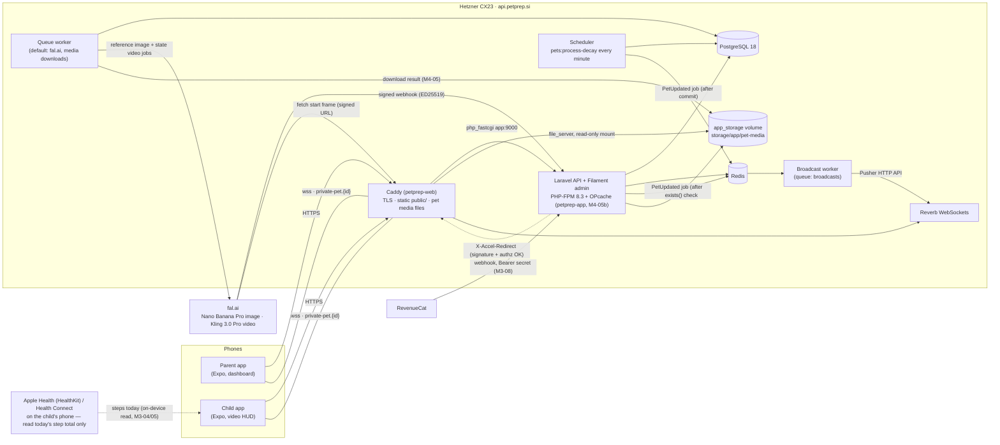

Runtime (M4-05b): every PHP container (app = php-fpm, reverb, queue, queue-broadcasts, scheduler) runs the same image `petprep-app` (code + `composer install --no-dev` baked in, uid 1000, caches built per container on start); Caddy runs `petprep-web` (caddy:2.8-alpine + `public/`). Video bytes never pass through PHP: Laravel only checks the signed URL and answers with an internal `X-Accel-Redirect` header, Caddy serves the file (Range, ETag) from `app_storage` mounted read-only.

## 2. Pairing (parent ↔ child) — legacy e-mail child flow (deprecated since M2-02; new profiles: §2c)

```mermaid
sequenceDiagram
  autonumber
  actor Parent
  actor Child
  participant API as Laravel API
  participant DB as PostgreSQL
  participant Q as Queue
  participant FAL as fal.ai
  Note over Parent: "Dodaj otroka" card (dashboard, or Controls)<br/>shown only while no child is paired
  Parent->>API: POST /api/parent/generate-pin (5/min)
  API->>DB: store 6-digit PIN (15 min, replaces the previous one)
  API-->>Parent: PIN → shown as "734 912" + live countdown + "Nova koda"
  Note over Parent,Child: parent tells the child the PIN<br/>(this child already signed in with e-mail — deprecated; PIN-only login: §2c)
  loop every 5 s while the PIN is valid
    Parent->>API: GET /api/parent/dashboard
  end
  Child->>API: POST /api/child/pair {pin}
  API->>DB: transaction: lock parent, link child,<br/>create UNBORN pet (Pet DNA, born_at null), consume PIN
  API-->>Child: 201 pet (born_at null, awaiting_contract, media_status=pending|disabled)
  API->>Q: GeneratePetReferenceImage (after commit)
  Q->>FAL: fal.run Nano Banana Pro (seed + DNA prompt)
  FAL-->>Q: image URL (*.fal.media)
  Q->>Q: StorePetMedia: download → our disk (M4-05)
  Q->>DB: pet_media image ready, media_status=ready
  Q-->>Child: PetUpdated "reference_image_ready" (Reverb, signed URL)
  Note over Q,FAL: then the entitled state videos — see §10a
  Parent->>API: GET /api/parent/dashboard → pet ≠ null, awaiting_contract
  Note over Parent: "Otrok je povezan!" → GET /api/user refreshes the session pet
  Note over Child,DB: unborn: no decay, hygiene events, day close or escalation;<br/>every child action except the contract → 423 contract_required
  Child->>API: POST /api/child/contract {signature} (Pogodba o odgovornosti)
  API->>DB: transaction: SELECT pet FOR UPDATE, pet_contracts row,<br/>birth: born_at = last_decay_at = last_step_reset_at = now,<br/>metrics 100 %, signed_contract row
  API-->>Child: 201 {status: accepted, state (unlocked)}
  API-->>Parent: PetUpdated "signed_contract" after commit (awaiting_contract false)
  Note over Child,DB: the dog is born — game loop runs from the signing moment (M1-07b)
```

## 2a. Family: second parent and shared pet (M2-01, ADR-012)

```mermaid
sequenceDiagram
  autonumber
  actor Mum as Parent A
  actor Dad as Parent B (new account)
  actor Kid2 as Child 2
  participant API as Laravel API
  participant DB as PostgreSQL
  Mum->>API: POST /api/parent/invite-parent (10/h)
  API->>DB: family_invites: 8-char code, 24 h, single use<br/>(A's previous unused code expires)
  API-->>Mum: 201 {code, expires_at}
  Note over Mum,Dad: code shared outside the app
  Dad->>API: POST /api/parent/join-family {code}
  alt wrong / expired / used code
    API-->>Dad: 422 invalid_code | code_expired | code_used<br/>(5 wrong in 15 min → 429)
  else B already has children or pets
    API-->>Dad: 409 family_not_empty (no merge)
  else ok
    API->>DB: transaction: lock invite, move B into A's family,<br/>delete B's empty family, used_at = now
    API-->>Dad: 200 {family {id, parents, children_count, pets_count}}
  end
  Dad->>API: POST /api/parent/generate-pin {pet_id: Rex}
  API->>DB: PIN on B (15 min), pairing_pet_id = Rex<br/>(Rex must be an active pet of this family, else 422 pet_not_joinable)
  Kid2->>API: POST /api/child/pair {pin}
  API->>DB: transaction: child → family (parent_id mirror = B),<br/>pet_caretakers (Rex, child 2, requires_contract)<br/>partial unique: child has no other active pet
  API-->>Kid2: 201 {joined_existing: true, pet: Rex (born_at unchanged), awaiting_contract: true}
  Kid2->>API: POST /api/child/pet/feed
  API-->>Kid2: 423 contract_required (only for child 2 — child 1 keeps playing)
  Kid2->>API: POST /api/child/contract {signature}
  API->>DB: pet_contracts (Rex, child 2) — no rebirth
  API-->>Kid2: 201 state (unlocked)
  Note over Mum,Kid2: every action stores actor_user_id;<br/>steps per child in pet_daily_steps, the pet's walk = sum;<br/>channel private-pet.{Rex}: both children + both parents
```

## 2b. Mobile app launch — session restore (M1-12) and start screen (M2-02)

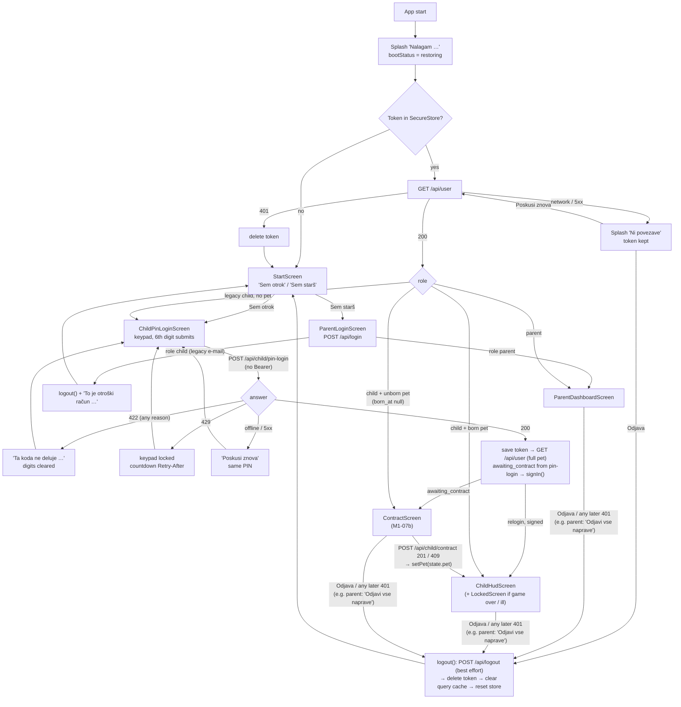

Parent side of §2c in the app: `FamilyChildrenCard` / "Dodaj otroka" → `AddChildScreen`: nickname + optional birth year → `POST /api/parent/children` → "Nov pes" ("Nov ljubljenček" when the catalogue offers > 1 species) → **picker** (`PetPickerStep`, M5-R04 → M5-R06-02: species tiles (skipped with one species) → plan → breed list from `GET /api/breeds` with search — paid shown locked on the free plan —, origin, age at arrival → summary; catalogue failure → today's two dogs) / "Pridruži se psu …" (no picker) → `POST /api/parent/generate-pin {child_id, pet_id? | species, breed, origin, age_stage, plan, features}` (profile all or nothing; 422 `breed_locked` / `breed_species_mismatch` / `species_unavailable` → back to the picker) → PIN + countdown; dashboard polled every 5 s until the child has a pet or one more device → "Otrok je povezan!".

## 2c. PIN-only child login (M2-02 / M2-03)

```mermaid
sequenceDiagram
  autonumber
  actor Parent
  actor Child as Child (own device, no account)
  participant API as Laravel API
  participant DB as PostgreSQL
  Parent->>API: POST /api/parent/children {display_name, birth_year?}<br/>(token ability parent)
  API->>DB: users row: role child, nickname, birth_year,<br/>email NULL, password NULL; family_user (child)
  API-->>Parent: 201 {child {id, …}}
  Parent->>API: GET /api/breeds?features[]=… (M5-R06-01 catalogue:<br/>cats only when the admin switch allows this family<br/>(M5-R06-09) + species_cat)
  Parent->>API: POST /api/parent/generate-pin {child_id, pet_id?,<br/>species?, breed?, origin?, age_stage?, plan?, features?}
  API->>DB: lock parent → child → family; mode = new_pet | join_pet | relogin;<br/>new pet: breed ∈ species (422 breed_species_mismatch), cat available<br/>(422 species_unavailable), free / paid from breed_configs.premium_unlock;<br/>revoke the child's open PIN; insert child_login_pins<br/>(HMAC-SHA256 of the PIN, 15 min)
  API-->>Parent: {pin "734 912", expires_at, mode}
  Note over Parent,Child: parent tells the child the PIN
  Child->>API: POST /api/child/pin-login {pin, device_name}<br/>(unauthenticated, 10/min per IP)
  alt locked out (≥ 10 failures from this IP or ≥ 100 overall in 15 min)
    API-->>Child: 429 too_many_attempts + Retry-After
  else no open, unexpired PIN with this HMAC
    API->>API: count failure (per IP + global)
    API-->>Child: 422 invalid_pin (same body for wrong / expired / used)
  else match
    API->>DB: transaction: lock parent → child → family → PIN row, re-check
    opt the pet is a cat and the child app lacks species_cat (M5-R06-01)
      API-->>Child: 422 app_update_required (PIN stays usable)
    end
    alt child never paired
      API->>DB: new_pet: create UNBORN pet + caretaker<br/>join_pet: caretaker of the shared pet (requires_contract)
    else child already a caretaker
      Note over API,DB: relogin: nothing re-paired
    end
    API->>DB: PIN consumed_at; token abilities ["child"];<br/>keep the newest 3 tokens of this child
    API-->>Child: 200 {token, user {id, name, role}, mode, pet, awaiting_contract}
  end
  Child->>API: POST /api/child/contract (Bearer, ability child) → birth (M1-07b)
  Parent->>API: DELETE /api/parent/children/{id}/tokens<br/>(lost phone: all devices signed out, open PIN revoked)
```

Token abilities (M2-03): `/api/parent/*` → `ability:parent`, `/api/child/*` → `ability:child`, then the policies (role + family). Tokens issued before M2-02 carry `*` and pass the ability check; the policies still keep the roles apart.

## 2d. Parent self-registration (M2-10a, 2026-10-05)

```mermaid
sequenceDiagram
  autonumber
  actor Parent
  participant App as Mobile app
  participant API as Laravel API
  participant DB as PostgreSQL
  Parent->>App: StartScreen "Sem starš" → ParentLoginScreen<br/>"Nimate računa? Registracija" → ParentSignupScreen
  Parent->>App: name, e-mail, password + repeat, ☑ terms + privacy
  App->>App: validateSignup (same rules as the backend)<br/>timezone = Intl resolvedOptions().timeZone
  App->>API: POST /api/register {name, email, password, password_confirmation,<br/>timezone, accept_terms: true, device_name}<br/>(no Bearer; throttle 5/min + 20/h per IP)
  alt throttled
    API-->>App: 429 + Retry-After → "poskusite znova čez N min"
  else invalid / e-mail taken (lower(email), case-insensitive)
    API-->>App: 422 {errors, codes: {field: code}} → Slovenian message per code
    Note over App,API: timezone_invalid → the app retries ONCE without timezone<br/>(aliases like Etc/UTC, Asia/Calcutta are already canonicalised by the server;<br/>unknown valid zones → Europe/Ljubljana)
  else ok
    API->>DB: transaction: users (role parent, email lower case,<br/>password hash, timezone, terms_accepted_at, terms_version)<br/>lost race on users_email_(lower_)unique → 422 email_taken<br/>→ families (timezone) + family_user (parent)<br/>→ personal_access_tokens (abilities ["parent"])
    API-->>App: 201 {token, abilities, user, pet: null, awaiting_contract: null}
    App->>App: SecureStore token → appStore.signIn()
    App->>API: GET /api/parent/dashboard (ability parent)
    API-->>App: empty family → "Dodaj otroka" (§2c)
  end
```

Not yet (M2-10b): e-mail verification and password reset need a mail provider; `email_verified_at` stays null. Apple / Google sign-in is M2-10c.

## 2e. Account deletion and data export (M2-08, 2026-10-05)

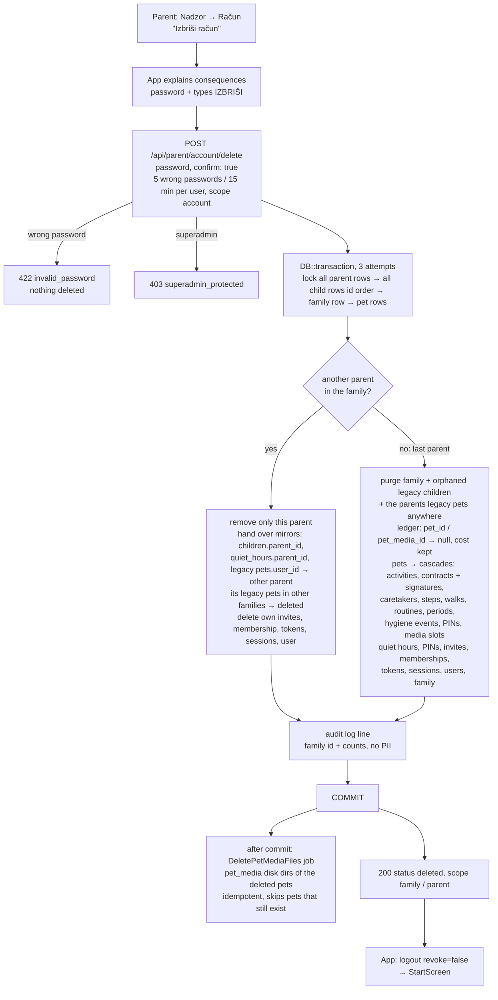

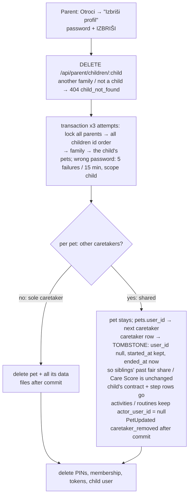

Late work after a deletion is harmless: queued `GeneratePetReferenceImage` / `SubmitPetStateVideo` / `StorePetMedia` find no pet / slot and return (a download that finishes after the deletion removes its file and the pet directory); a late fal webhook matches the ledger row whose slot is gone → **200 "Superseded."**; the decay tick, escalation and routine ledger skip pet ids whose row disappeared under the lock.

```mermaid
sequenceDiagram
  autonumber
  actor Parent
  participant App as Mobile app
  participant API as Laravel API
  Parent->>App: Račun → "Izvozi moje podatke"
  App->>API: GET /api/parent/account/export (throttle 3/h per user)
  alt more than privacy.export_max_rows history rows
    API-->>App: 413 export_too_large
  else ok
    API-->>App: 200 JSON (Content-Disposition: attachment; Cache-Control: no-store)<br/>family, parents, children, quiet hours, invites, pets with history,<br/>contracts incl. signature, scores, signed media URLs (~1 h)<br/>never: password hashes, tokens, PIN hashes, invite codes, fal URLs
    App->>Parent: system share sheet (pretty JSON as text, title petprep-izvoz-DATE.json)
  end
```

## 3. Game loop tick (every minute)

```mermaid
flowchart TD
  T([Scheduler tick]) --> IDS["Load IDs of active, born pets<br/>(unborn = born_at null are skipped, M1-07b)"]
  IDS --> L{{For each pet: transaction + row lock}}
  L --> RC{"Illness over?<br/>(illness_until ≤ now)"}
  RC -- yes --> REC["Fresh start at illness_until:<br/>hygiene 100 %, neglect clocks restart,<br/>escalation 0"]
  RC -- no --> F
  REC --> F{Frozen?<br/>hard stop · ill · game over}
  F -- yes --> FC["Advance last_decay_at<br/>(no catch-up, neglect clocks paused)<br/>midnight: close day, no walk illness"]
  F -- no --> SEG["Split elapsed time since last_decay_at<br/>into normal / quiet segments<br/>(family timezone, DST-aware)"]
  SEG --> D["Decay from breed_configs:<br/>hunger 8|12 %/h · thirst 10|15 %/h<br/>quiet hours ×0.10"]
  D --> MN{"New family-local day?"}
  MN -- yes --> RS["Close yesterday: pet_daily_walks row<br/>energy showed 0 % → walk_illness_due_at<br/>= end of the night's quiet hours<br/>Steps → 0, energy → 0 %"]
  MN -- no --> HS
  RS --> HS["Schedule today's hygiene events<br/>(poops_per_day, outside quiet hours)<br/>+ M5-R02: decide today's chewing<br/>(walk missed yesterday · teething roll)<br/>+ M5-R05: decide today's play invitations,<br/>expire old ones (mood only, §5f)"]
  HS --> HA{"Pending poop / chewing in<br/>(last_decay_at, now]?"}
  HA -- yes --> H0["Hygiene → 0 %<br/>zero_since = event time"]
  HA -- "no / skipped" --> AC
  H0 --> AC{"M5-R02: puppy bladder clock<br/>due in (last_decay_at, now]?"}
  AC -- yes --> A0["Accident at the due instant<br/>hygiene → 0 % · clock restarts"]
  AC -- no --> Z
  A0 --> Z
  Z["Zero tracking (hunger · thirst · hygiene — not energy)<br/>& pet_state on displayed (rounded) values"] --> W{Displayed value changed?}
  W -- yes --> B["Save + PetUpdated::afterCommit<br/>(job on 'broadcasts' queue, never throws)"]
  W -- no --> QS[Save quietly]
  B --> E
  QS --> E
  FC --> E[Escalation service]
```

## 4. Escalation & neglect

```mermaid
stateDiagram-v2
  [*] --> Unborn: pairing (PIN)
  Unborn --> OK: contract signed = birth<br/>(born_at = now, metrics 100 %)
  note left of Unborn: waiting for the contract —<br/>no decay, no hygiene events,<br/>no day close, no escalation;<br/>actions 423 contract_required
  OK --> Phase1: displayed hunger / thirst / hygiene ≤ 30 %<br/>(energy is off the ladder: separate daily walk reminder)
  Phase1 --> Phase2: ≤ 10 %
  Phase2 --> Phase3: hunger / thirst / hygiene 0 % for > 1 h<br/>(parent alarm — never from energy)
  Phase1 --> OK: all ≥ 31 %
  Phase2 --> OK: all ≥ 31 %
  Phase3 --> Ill: hygiene 0 % ≥ 6 h<br/>(counted outside quiet hours only)
  OK --> Ill: no walk yesterday (energy showed 0 % at midnight)<br/>→ ill from the end of the night's quiet hours
  Ill --> OK: after 12 h lockout<br/>hygiene 100 %, clocks reset (fresh start)
  Phase3 --> GameOver: hunger / thirst / hygiene 0 % ≥ 24 h
  GameOver --> [*]: parent reset (M2-07)
  note right of Ill: frozen — no decay, no hygiene events,<br/>neglect clocks paused, actions refused.<br/>Recovery: hygiene 100 %, every running<br/>neglect clock restarts at recovery,<br/>hunger / thirst unchanged (David 2026-10-03)
  state HardStop
  OK --> HardStop: parent hard stop
  HardStop --> OK: parent lifts (clocks resume)
```

### Daily walk rule (energy, David 2026-10-03)


## 5. Child actions (M1-07: `/api/child/pet/*`, `/api/child/contract`)

### 5a. Feed / water / clean / contract

```mermaid
sequenceDiagram
  autonumber
  actor Child
  participant App as Child app
  participant API as ChildPetController
  participant S as PetActivityService
  participant C as CareScheduleService
  participant DB as PostgreSQL
  Child->>App: taps Feed (or Water / Clean / signs contract)
  App->>API: POST /api/child/pet/feed (Bearer, child token)
  API->>API: ChildPetRequest → PetPolicy (child only, else 403)<br/>currentPet() (none → 404 no_pet)
  API->>S: feed(pet)
  S->>DB: BEGIN · SELECT pet FOR UPDATE
  S->>S: illness over? → fresh start (recoverFromIllnessIfDue)
  alt game over / inactive / hard stop / contract required (unborn) / ill
    S-->>API: LOCKED + reason → 423 {reason, locked_until, state}
  else
    S->>S: catch up decay since last tick (PetDecayService::catchUpLocked)
    alt hygiene shows 0 %
      S-->>API: REFUSED needs_cleaning → 422
    else
      S->>C: feeding(pet, breed, now) — windows in family tz,<br/>last fed_pet row in activities_log
      alt outside window / already fed in this window
        S-->>API: REFUSED + next window start → 422 {reason, next_allowed_at}
      else
        S->>DB: hunger 100 %, hunger_zero_since null, pet_state<br/>fed_pet row (value = hunger before)
        S-->>API: ACCEPTED → 200 {status, state}
      end
    end
  end
  S->>DB: COMMIT
  S-->>App: one PetUpdated after commit ("fed_pet",<br/>or "metric_changed" if only the catch-up changed what shows)
  Note over S,C: Water: same flow, CareScheduleService::water —<br/>water_times_per_day per local day, ≥ water_min_gap_minutes real minutes<br/>since the last refill (also across midnight) → thirst 100 %, watered_pet row
  Note over S,DB: Clean: settles due hygiene events, hygiene 100 %, cleaned_poop row (no window).<br/>Contract: allowed while contract_required; once per pet → pet_contracts row + signed_contract row → 201<br/>(unborn pet: birth in the same transaction, M1-07b); again → 409
```

### 5b. Step sync

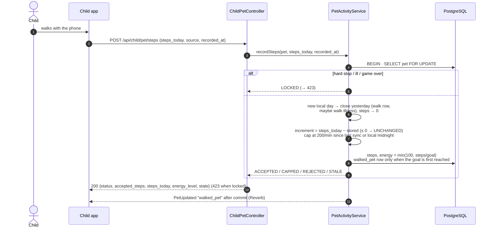

### 5b′. Where the phone's step total comes from (M3-04 / M3-05 / M3-06)

Sources overlap (one walk is seen by the motion sensor AND the health store), so the app sends the **maximum**, never the sum. Only the number leaves the phone.

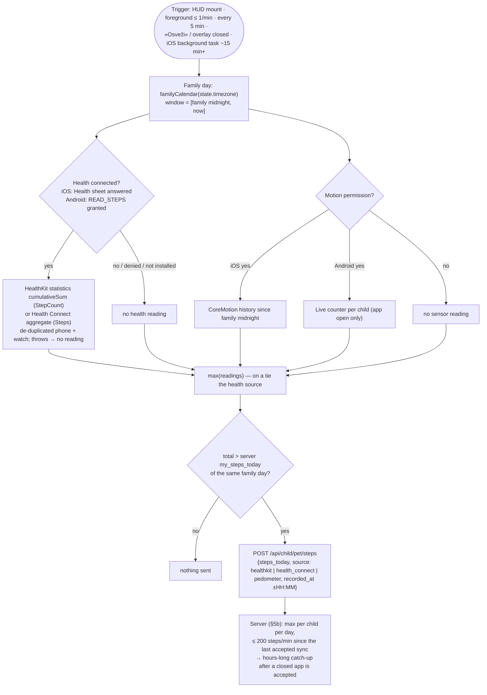

Background (iOS only): `expo-background-task` registered by the child HUD once Apple Health is connected, unregistered on logout; the task restores the token, `GET /api/child/pet` (zone, lock, server count), reads as above, posts. Android has no background read (Health Connect would need `READ_HEALTH_DATA_IN_BACKGROUND`); its history is caught up on the next app open.

### 5c. Child app: action ↔ cache ↔ Reverb (M1-13 / M1-14 / M1-15 / M1-16)

```mermaid
sequenceDiagram
  autonumber
  actor Child
  participant HUD as ChildHudScreen
  participant Q as TanStack cache ['child','pet']
  participant API as Laravel API
  participant Rev as Reverb (private-pet.{id})
  participant Store as appStore (lock / contract)

  HUD->>API: GET /api/child/pet (useChildPet)
  API-->>Q: state → normalizeChildState (server_time)
  Note over HUD,Rev: wsStatus ≠ connected (not subscribed yet / dropped / 403)<br/>→ refetch every 10 s; connected → no polling
  Child->>HUD: taps Hrani (enabled only if feeding.can_feed)
  HUD->>Q: cancel in-flight GET · optimistic hunger 100 %
  HUD->>API: POST /api/child/pet/feed
  alt 200 accepted / unchanged
    API-->>Q: replace with response.state · toast "Njam! Kuža je sit."
  else 422 refused (outside_feed_window, water_too_soon, needs_cleaning …)
    API-->>Q: replace with error.state (rollback) · toast "Kuža bo lačen spet ob 17:00."<br/>(next_allowed_at in state.timezone)
  else 423 locked (hard_stopped / ill / game_over / inactive / contract_required)
    API-->>Q: replace with error.state
  else offline / 5xx / 429 (no state)
    HUD->>Q: restore previous view · toast "Ni povezave …"
  end
  Rev-->>HUD: .pet.updated {…, emitted_at}
  HUD->>Q: applyBroadcast — drop if emitted_at < last emitted / snapshot;<br/>else metrics + lock flags; non-tick or lock change → refetch GET
  Q-->>Store: lockStateFromView → setLockState(hard_stop | illness | game_over | inactive, until, tz)<br/>awaiting_contract → setAwaitingContract(true)
  Store-->>HUD: AppNavigator: LockedScreen over the HUD (unlocks live) · ContractScreen instead of the HUD
  Note over HUD,Q: timer at the earliest of next window start, current window end,<br/>water next_allowed_at, next family midnight → refetch GET (also while live)
  loop on mount (sensor granted or Health connected), on foreground (≤ 1/min), every 5 min, on walk overlay close
    HUD->>API: POST /api/child/pet/steps {steps_today, source, recorded_at ±HH:MM}<br/>max of Apple Health / Health Connect and the sensor (iOS: CoreMotion since the FAMILY midnight · Android: live counter per child), family day — only if > my_steps_today of that family day (§5b′)
    API-->>Q: replace with response.state (any status; 423 too)
  end
```

### 5d. Behaviour events (M5-R02, David 2026-10-06)

Puppy bladder clock and "Pelji ven" (2-month puppy = 2 h; quiet hours school 08–13, bedtime 22–06):

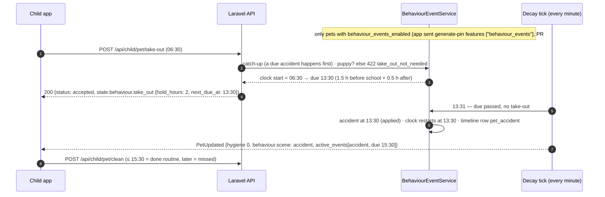

Chewing and how each mess is resolved:

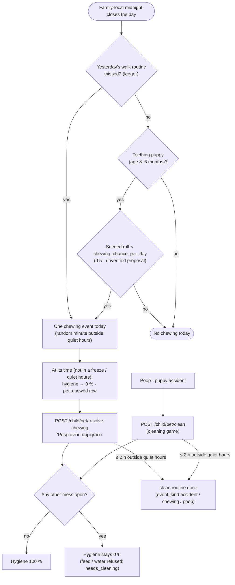

### 5e. Training mini-game (M5-R03, David 2026-10-06)

The server picks the schedule and scores; the app receives the schedule and reports tap offsets — a modified app could fake taps (budget caps the gain, < 150 ms reactions are too early, uniform latencies are logged).

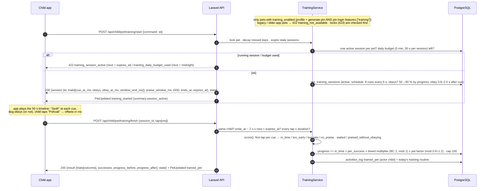

Routine, decay and effects:

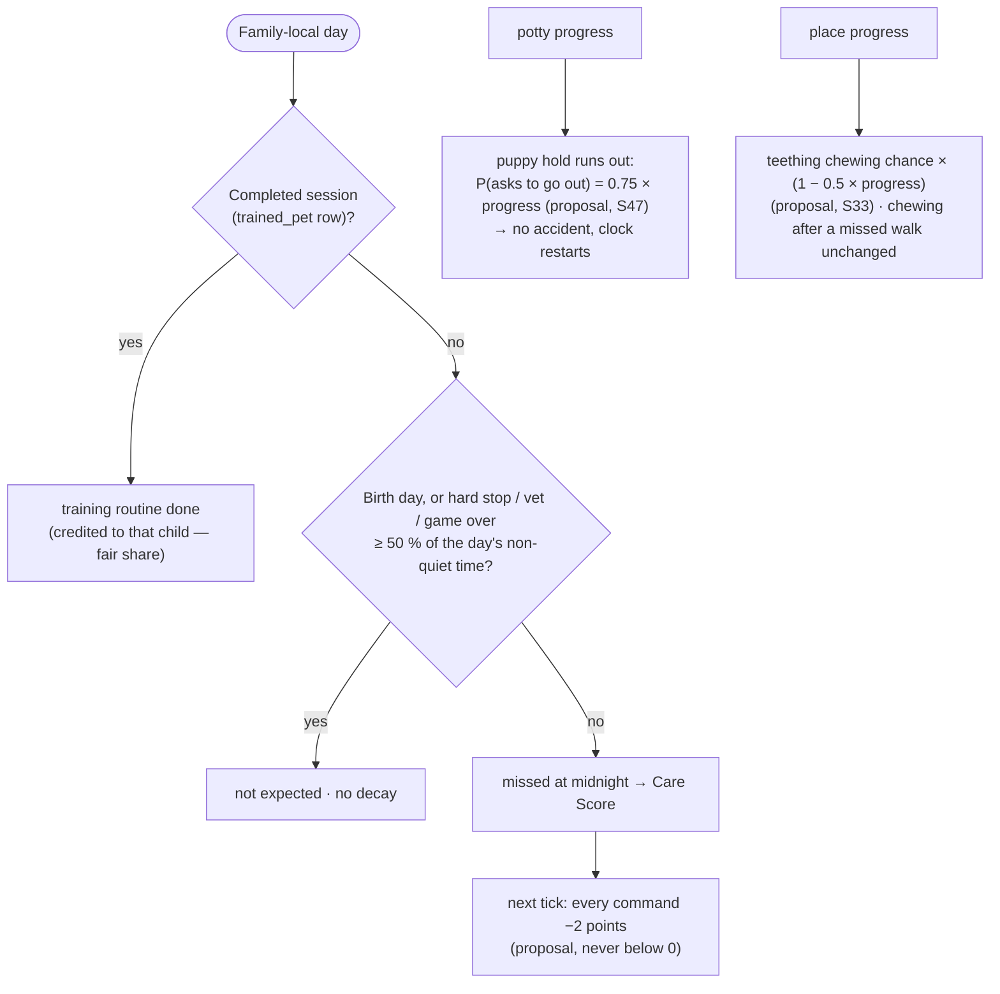

### 5f. Play & cuddle (M5-R05, David 2026-10-07 / 2026-10-08)

Mood and video only — nothing here reaches a metric, routine, Care Score, report or certificate. Numbers marked (D) are in `config/play.php`.

```mermaid
sequenceDiagram
  autonumber
  participant Tick as Decay tick (every minute)
  participant P as PlayService
  participant DB as PostgreSQL
  participant C as Child app
  participant API as Laravel API
  participant R as Reverb (private-pet.{id})
  Note over P: play only for a challenge in trial or paid (not a mutt shown as free),<br/>not waiting for payment, with a profile (legacy: no — D), born, active
  Tick->>P: ensureInvitationsScheduled (once per family-local day)
  P->>DB: pet_play_events: 1 ball + 1 cuddle invitation, random order,<br/>whole minutes in 07:00–20:00 outside quiet hours, ≥ 3 h apart, open 2 h (D)
  Tick->>P: expireDue (pending past expires_at → expired) · frozen: skipWhileFrozen
  Tick->>P: offeredInvitationId before / after the tick
  alt invitation appears or ends (and no metric change)
    Tick-->>R: PetUpdated play {play.invitation}
  end
  Note over P: invitation shown only while today's walk goal is reached (David Q4),<br/>hunger and thirst > 30 % (D), no mess, not quiet hours, not locked
  C->>API: POST /api/child/pet/play {kind: play | cuddle} (mini-game finished)
  API->>P: lock pet · 423 locks · decay catch-up · canPlayNow? else 422 play_not_available
  alt same child + kind within 10 s (D)
    API-->>C: 200 unchanged (no row, no broadcast)
  else shown invitation of that kind
    P->>DB: invitation → done (completed_by = first child, Q8)
  else
    P->>DB: free row (done)
  end
  P->>DB: pets.happy_until = now + 30 min (Q5)
  P->>DB: activities_log played_with_pet / cuddled_pet (1 row per child + kind per hour, D; else value + 1)
  API-->>C: 200 {play {kind, source}, state.play {can_play, invitation, mood {happy_until, scene: playing}}}
  API-->>R: PetUpdated play (after commit)
  Note over R: parent dashboard: timeline row + play_today {play, cuddle} — no push, no score
```

### 5g. Cat wand play instead of the walk (M5-R06-04, David 2026-10-08)

Cats only (hidden behind `PETPREP_CATS_ENABLED`). The server starts the ~60 s game and judges the finish; only a **successful** session counts (meter, routine, 2 h gap). Numbers: goal and gap from `breed_stage_params` (`play_sessions_per_day` kitten 3 / cat 2, `play_min_gap_minutes` 120 — David), game mechanics in `config/wand.php`.

```mermaid
sequenceDiagram
  autonumber
  participant C as Child app
  participant API as Laravel API
  participant W as WandPlayService
  participant DB as PostgreSQL
  participant R as Reverb (private-pet.{id})
  Note over W: cat with a profile only (a dog → 422 wand_not_available) · locks (423) first
  C->>API: POST /api/child/pet/wand/start
  API->>W: lock pet · decay catch-up (midnight → meter 0) · expire / interrupt stale sessions
  W->>DB: goal today > 0? mess open? quiet hours now or before the game + TTL ends (cat sleeps)?<br/>last SUCCESSFUL finish + 120 min > now?<br/>another child's game running? game + TTL past local midnight?
  alt refused
    API-->>C: 422 needs_cleaning / wand_quiet_hours (next = end of quiet) / wand_too_soon (next = gap end) / wand_session_active (next = its TTL) / wand_day_ending (next = midnight)
  else ok
    W->>DB: same child's active game → aborted (no penalty)
    W->>DB: pet_care_sessions (wand_play, active, 60 s, schedule: pounces, catch_at_ms)
    API-->>C: 200 {session {id, ends_at, expires_at, catch_at_ms, pounces_ms, min_away_moves, segments}, state.wand}
    API-->>R: PetUpdated wand_started
  end
  Note over C: child drags the feather ~60 s; the cat pounces and catches it at the end;<br/>app records each move {t ms, away: moved away from the cat?}
  C->>API: POST /api/child/pet/wand/finish {session_id, moves[]}
  API->>W: same child? ends_at − 5 s ≤ now < expires_at? lock began during the game? every t ≤ 60 000?
  W->>W: score(): ≥ 8 away moves (< 300 ms apart count once) · one in each 15 s quarter · away ≥ 50 %<br/>· an away move ≤ 2 s after every pounce · gaps not machine-regular
  alt took part
    W->>DB: session completed · pets.energy_level = sessions today / goal × 100 (never lowered)
    W->>DB: activities_log played_wand (actor child, value = n-th of the day) = the play routine
    API-->>C: 200 accepted {result {success: true, away_moves, segments_hit}, state}
    API-->>R: PetUpdated played_wand
  else not enough
    W->>DB: session failed (no meter, no gap, no penalty)
    API-->>C: 200 rejected {result {success: false, reason: too_few_moves | not_spread | wrong_technique | missed_pounces | too_uniform}} — start again at once
    API-->>R: PetUpdated wand_finished (the game ended)
  end
```

The cat's day (no walk, no walk illness):

```mermaid
flowchart TD
  D([Family-local day of a cat]) --> S["Successful wand sessions<br/>(played_wand rows)"]
  S --> G{"≥ play_sessions_per_day?<br/>(kitten 3 · cat 2)"}
  G -- yes --> DONE["play routine done · meter 100 %<br/>child credited with ≥ ⌈goal / n⌉ own sessions (fair share)"]
  G -- no --> EX{"Birth day, hard stop / vet / game over ≥ 50 % of the non-quiet time,<br/>or quiet hours leave room for fewer games than the goal?"}
  EX -- yes --> NONE["not expected"]
  EX -- no --> MISS["missed at midnight → Care Score"]
  MISS --> FACT["midnight close: pets.play_missed_on = that day<br/>(M5-R06-05: 'scratched the sofa' next day)"]
  M([Family-local midnight]) --> RESET["meter (energy) → 0 · no pet_daily_walks row · never walk illness"]
  LOW["meter ≤ 30 % outside quiet hours"] --> PUSH["play_reminder · once a day · not before night end + 2 h<br/>held while a sibling plays / the gap runs · dropped if the cat played (play_done) or a start is refused without an end today (not_actionable)"]
```

### 5h. Cat litter, scratching and grooming (M5-R06-05, David 2026-10-08)

Cats only (hidden behind `PETPREP_CATS_ENABLED`). A litter use is **not** a mess; only an unscooped tray becomes one. Numbers: `litter_uses_per_day` 3 / 2, `litter_scoop_deadline_hours` 4, `litter_full_change_days` 7, `grooming_sessions_per_week` 3 (Maine Coon) from `breed_stage_params`; overdue 2 h, scratching 2 h and "matted after ≥ 2 missed" are game constants traced to `cat-data/data.json`; mini-game mechanics in `config/cat_care.php`.

```mermaid
flowchart TD
  U([Litter use at a random minute outside quiet hours<br/>kitten 3 · cat 2 a day]) --> D["tick: due_at = 4 h outside quiet hours<br/>2 h while last week's change was missed and not done since"]
  D --> Q{"Scooped before due_at?<br/>POST /pet/litter/scoop · weekly change · cleaning the accident"}
  Q -- yes --> OK["litter_scoop routine done (actor = child)"]
  Q -- no --> F{"Deadline passed in a normal tick?<br/>(not frozen, no outage)"}
  F -- no --> SKIP["escalated_at · no accident · routine missed / excused"]
  F -- yes --> ACC["litter_accident at due_at · hygiene 0 · pet_litter_accident row"]
  ACC --> LADDER["dog ladder: phases · alarm after 1 h · illness after 6 h outside quiet · game over after 24 h"]
  ACC --> CLEAN["POST /pet/clean → hygiene 100 % + tray scooped"]
  W([Program week: weekly birthday → next]) --> CH{"litter_change session completed in the week?"}
  CH -- yes --> CHD["litter_change routine done (on the day the week ends)"]
  CH -- no --> CHM["missed → next week's uses get 2 h until changed"]
```

```mermaid
sequenceDiagram
  autonumber
  participant C as Child app
  participant API as ChildPetController
  participant S as ScratchingService
  participant DB as PostgreSQL
  participant R as Reverb
  Note over S: midnight close: play routine missed → play_missed_on = yesterday<br/>→ one scratching at a random minute outside quiet hours (max 1/day)
  Note over S: tick applies it like chewing: hygiene 0 · pet_scratched · scene "scratching" · 2 h deadline outside quiet
  C->>API: POST /api/child/pet/scratching/start
  API->>S: start (lock, decay catch-up)
  S->>DB: pet_care_sessions (scratching, land_at_ms 800–2000, praise window 3000 ms)
  API-->>C: 200 {session {id, land_at_ms, praise_window_ms, min_reaction_ms}}
  C->>API: POST /api/child/pet/scratching/finish {session_id, praise_ms}
  alt land + 150 ms ≤ praise ≤ land + 3 s
    S->>DB: scratching cleaned · hygiene 100 % (no other mess) · resolved_scratching (actor child)
    API-->>R: PetUpdated resolved_scratching
  else too early / too late / no praise
    API-->>C: 200 rejected — no penalty, try again
    API-->>R: PetUpdated scratching_finished
  end
```

```mermaid
flowchart TD
  G([Maine Coon grooming — POST /pet/grooming/start + finish]) --> R{"Refused?"}
  R -- "week done (3) · today done · quiet hours · another child · mess open" --> NO["422 + next_allowed_at"]
  R -- no --> S["30 s comb strokes (60 s while matted)"]
  S --> OKG["groomed_pet → a grooming slot of the week · matted coat cleared"]
  WE([Weekly birthday — tick closeGroomingWeek]) --> M{"≥ 2 of the week's 3 slots missed?"}
  M -- yes --> MAT["coat_matted_at + pet_coat_matted row<br/>visible only: no illness, no metric / mood effect"]
  M -- no --> FINE["nothing"]
  MAT --> S
```

### 5i. Cat HUD in the app (M5-R06-08b, 2026-10-09)

Hidden until R06-09 (`CAT_UI_READY` false). The dock and chips only open the mini-games; the server judges every game. Broadcasts update the cat blocks at once; texts switch to the cat's while the child app shows a cat.

```mermaid
flowchart TD
  V["ChildPetView (GET /api/child/pet)<br/>pet.species = cat"] --> K{"dockKinds(view)"}
  K -->|dog| DD["Hrani · Voda · (Pelji ven) · Sprehod · Očisti<br/>(unchanged)"]
  K -->|cat| CD["Hrani · Voda · Pesek · Igra · Očisti<br/>no walk / steps / Šola"]
  CD -->|Pesek| O1["openCatGame('scoop')"]
  CD -->|Igra| O2["openCatGame('wand')"]
  CH["Chips: Počeši (Maine Coon) · Menjava peska · Crkljanje"] -->|tap| O3["openCatGame('grooming' / 'litter_change')<br/>or PlayOverlay 'cuddle'"]
  SC["Scratched-sofa card: Na praskalnik"] --> O4["openCatGame('scratching')"]
  O1 & O2 & O3 & O4 --> OV["CatCareOverlay → start / finish (server judges)"]
  OV --> ST["state from the 200 / 422 → cache"]
  B["PetUpdated (pet level, no viewer)"] --> BC["applyBroadcast → broadcastCatCare<br/>counters · deadlines · blocked_reason · next_allowed_at<br/>own session + own count kept"]
  BC --> V
  R["422 needs_cleaning"] --> M{"cleanFirstKind"}
  M -->|only scratching| T1["Najprej odnesi muco na praskalnik …"]
  M -->|dog, only chewing| T2["Najprej pospravi copat …"]
  M -->|else| T3["Najprej pospravi / počisti …"]
```

## 6. Data model (core)

Family model (M2-01, ADR-012): `families` own pets and quiet hours; `family_user` puts parents and children in a family; `pet_caretakers` links children to pets (shared pet = several rows). `users.parent_id` and `pets.user_id` are deprecated mirrors.

```mermaid
erDiagram
  FAMILIES ||--|{ FAMILY_USER : "members"
  USERS ||--o| FAMILY_USER : "one family"
  FAMILIES ||--o{ PETS : "owns"
  FAMILIES ||--o{ CHALLENGE_CREDITS : "purchased challenges (M3-11)"
  PURCHASE_EVENTS ||--o| CHALLENGE_CREDITS : "one credit per purchase"
  PETS |o--o| CHALLENGE_CREDITS : "paid by (one unrevoked)"
  FAMILIES |o--o{ PURCHASE_EVENTS : "RevenueCat ledger (null after delete)"
  FAMILIES ||--o| QUIET_HOURS : "one per family"
  FAMILIES ||--o{ FAMILY_INVITES : "second parent"
  PETS ||--|{ PET_CARETAKERS : "1..n children"
  USERS ||--o{ PET_CARETAKERS : "child, max 1 active pet"
  PETS ||--o{ PET_DAILY_STEPS : "steps per child per day"
  USERS ||--o{ ACTIVITIES_LOG : "actor (child)"
  USERS ||--o{ USERS : "parent_id (deprecated)"
  USERS ||--o{ PETS : "user_id (deprecated, primary caretaker)"
  PETS ||--o{ ACTIVITIES_LOG : logs
  PETS ||--o{ PET_MEDIA : "image + state video slots (M4-03)"
  PET_MEDIA ||--o{ AI_SPEND_LEDGER : "estimated cost per call"
  PET_LOOKS ||--o{ PETS : "shared look of a free pet (M4-10)"
  PET_LOOKS ||--o{ PET_MEDIA : "look rows: one per kind/state/stage (M4-10)"
  PET_MEDIA ||--o{ PET_MEDIA : "look_media_id: pet slot shows a look row"
  PETS ||--o{ PET_HYGIENE_EVENTS : "messes: poop, puppy accident, chewing; cat: litter uses, litter accident, scratching"
  PETS ||--o{ PET_PLAY_EVENTS : "play invitations + finished plays (mood only, M5-R05)"
  PETS ||--o{ PET_DAILY_WALKS : "closed days"
  PETS ||--o{ PET_CONTRACTS : "one per caretaker"
  PETS ||--o{ PET_STATUS_PERIODS : "hard stop / illness / inactive (M2-06)"
  PETS ||--o{ PET_DAILY_ROUTINES : "closed days' routines (M2-06)"
  USERS ||--o{ PET_DAILY_ROUTINES : "actor (child)"
  USERS ||--o{ CHILD_LOGIN_PINS : "one-time PIN for a child (M2-02)"
  FAMILIES ||--o{ CHILD_LOGIN_PINS : "issued in"
  BREED_CONFIGS ||--o{ PETS : "tunables by breed_slug"
  FAMILIES {
    bigint id
    string timezone "family tz, every wall-clock rule"
  }
  CHALLENGE_CREDITS {
    bigint family_id
    bigint purchase_event_id "unique"
    string product_id "petprep_challenge_12w"
    string transaction_id "refund match"
    bigint pet_id "null = available"
    timestamp assigned_at
    string assigned_via "parent or webhook"
    timestamp revoked_at "refund"
  }
  PURCHASE_EVENTS {
    string event_id "RevenueCat event.id, unique"
    string type
    string app_user_id "our parent id"
    string environment "SANDBOX or PRODUCTION"
    jsonb payload "without subscriber_attributes"
    string outcome
  }
  CHILD_LOGIN_PINS {
    bigint child_user_id
    bigint pet_id "join target, nullable"
    string pin_hash "HMAC, open ones unique"
    timestamp expires_at "15 min"
    timestamp consumed_at
    timestamp revoked_at
  }
  FAMILY_USER {
    bigint family_id
    bigint user_id "unique"
    string role "parent or child"
  }
  FAMILY_INVITES {
    string code "8 chars, unique"
    timestamp expires_at "24 h"
    timestamp used_at "single use"
  }
  PET_CARETAKERS {
    bigint pet_id
    bigint user_id "child"
    bool pet_is_active "trigger copy, partial unique"
    bool requires_contract
  }
  PET_DAILY_STEPS {
    bigint pet_id
    bigint user_id
    date local_date
    int steps
    timestamp last_sync_at
  }
  ACTIVITIES_LOG {
    bigint pet_id
    bigint actor_user_id "null = system"
    string activity_type
  }
  USERS {
    bigint id
    string name "child: nickname"
    string email "nullable (PIN-only child)"
    string password "nullable (PIN-only child)"
    smallint birth_year "optional, child"
    string role "parent or child"
    bigint parent_id "deprecated"
    string timezone "parent: mirror of family"
    string pairing_pin
    bigint pairing_pet_id "join PIN target"
  }
  PETS {
    bigint id
    bigint family_id
    bigint user_id "deprecated"
    string breed_type "mutt border_collie labrador_retriever golden_retriever french_bulldog german_shepherd cavalier_king_charles_spaniel beagle standard_poodle dachshund domestic_cat maine_coon"
    string species "dog or cat, follows breed (M5-R06-01)"
    string name "optional label set by a parent, null = none (M5-R08)"
    double hunger_level
    double thirst_level
    double energy_level
    double hygiene_level
    int daily_step_count
    timestamp last_step_reset_at
    timestamp last_step_sync_at
    timestamp last_decay_at
    timestamp frozen_at
    date hygiene_scheduled_through
    timestamp walk_illness_due_at
    timestamp born_at "null = unborn (M1-07b)"
    string media_status
    jsonb pet_dna
    bool is_hard_stopped
    bool is_game_over
  }
  BREED_CONFIGS {
    string breed_slug
    int daily_steps_required
    float hunger_decay_rate
    float thirst_decay_rate
    smallint poops_per_day
    jsonb feed_windows
    smallint water_times_per_day
    smallint water_min_gap_minutes
    boolean premium_unlock "only free or paid source (M5-R06-01)"
    string species "dog or cat"
    int sort_order "picker order"
    jsonb search_keywords "picker synonyms"
    string label_key "i18n breed name"
  }
  PET_HYGIENE_EVENTS {
    string kind "poop accident chewing (M5-R02) litter_use litter_accident scratching (M5-R06-05)"
    date local_date
    timestamp scheduled_at
    string status "pending applied skipped"
    timestamp cleaned_at "cleaned or scooped"
    timestamp due_at "litter use: scoop deadline (M5-R06-05)"
    timestamp escalated_at "litter use: deadline handled"
  }
  PET_PLAY_EVENTS {
    string kind "play cuddle (M5-R05)"
    string source "invitation free"
    date local_date
    timestamp scheduled_at "invitations only"
    timestamp expires_at "invitations only"
    string status "pending done expired skipped"
    bigint completed_by FK "child, null on delete"
    timestamp completed_at
  }
  PET_DAILY_WALKS {
    date local_date
    int steps
    int goal
    bool achieved
    bool birth_day
    timestamp illness_due_at
    timestamp illness_started_at
  }
  PET_CONTRACTS {
    bigint pet_id "unique with user_id"
    bigint user_id "the child"
    string signature_format "svg_path or png"
    text signature
    timestamp signed_at "server time"
  }
  PET_MEDIA_JOBS {
    string request_id
    string status
    string pet_state
    text result_url
  }
```

## 7. Delivery pipeline

```mermaid
flowchart LR
  BR[Feature branch] --> PR[Pull request]
  PR --> CI1["Backend tests<br/>Pest on PostgreSQL"]
  PR --> CI2["Mobile checks<br/>tsc + Jest"]
  CI1 & CI2 --> REV["Independent AI review<br/>(qa-reviewer)"]
  PR --> CI3["Deploy script<br/>shellcheck + harness"]
  PR --> CI4["Production image (M4-05b)<br/>hadolint · build app + web · caddy validate · smoke"]
  REV --> M[Merge to main]
  CI3 & CI4 --> M
  M --> DEP["Deploy job<br/>rsync → incoming/ → deploy-production.sh"]
  DEP --> PROD[(api.petprep.si)]
```

### 7a. deploy-production.sh (M2-01 / PR #24 / M4-05b)

```mermaid
flowchart TD
  A["1 env preflight<br/>(no git / docker before)"] --> B["2 record previous release<br/>.deployed-sha + releases/previous"]
  B --> C["3 buildx preflight · build petprep-app:next + petprep-web:next<br/>from the NEW tree (incoming/ or git archive)"]
  C --> D["smoke: run --rm app php artisan optimize<br/>(new image, production env)"]
  D --> ST["storage: chown -R 1000:1000 as root (new image)<br/>verify writable as uid 1000"]
  C -- fails --> X0["exit ≠ 0 · nothing changed<br/>old release keeps serving"]
  D -- fails --> X0
  ST -- fails --> X0
  ST --> E["4 artisan down (old code, exec --user 1000)"] --> F["5 pg_dump backup"] --> G["6 code switch repo/<br/>promote :production→:previous, :next→:production"]
  G --> H{"Caddyfile changed?"}
  H -- yes --> HV["caddy validate (new image)"]
  H -- no --> I
  HV --> I["7 postgres/redis · migrate --force"]
  I --> J["8 up -d app reverb queue queue-broadcasts scheduler caddy<br/>(entrypoint: per-container caches)<br/>+ force-recreate caddy if Caddyfile changed"]
  J --> K["re-chown storage (warn-only) · wait: php-fpm-ping"] --> L["queue:restart"] --> M2["9 artisan up (3×)"] --> N["health /up through Caddy (5×)<br/>--resolve api.petprep.si:443 → IP site fallback"]
  N --> O["image prune (dangling) · builder prune (> 7 days, keep 5 GB)"]
  G & HV & I -- "fails (pre-migration)" --> R1["revert code + images (:previous→:production)<br/>restart workers · artisan up"]
  J & K & N -- "fails (post-migration)" --> R2["keep new release (schema is new)<br/>up -d · restart workers · artisan up · loud error"]
```

## 8. Real-time delivery (M1-08 private channel, M1-09 queue)

```mermaid
sequenceDiagram
  autonumber
  participant App as Child / parent app<br/>(pusher-js + Echo)
  participant Caddy as Caddy (TLS)
  participant API as Laravel API
  participant Rev as Reverb
  participant Svc as Service<br/>(tick · child action · escalation · hard stop)
  participant Redis as Redis queue "broadcasts"
  participant W as queue-broadcasts worker

  App->>Caddy: wss connect /app/{key}
  Caddy->>Rev: upgrade
  Rev-->>App: socket_id
  App->>API: POST /api/broadcasting/auth<br/>Bearer token · socket_id · channel_name=private-pet.{id}
  API->>API: auth:sanctum → PetPolicy::listen<br/>(owner child or that child's parent)
  alt allowed
    API-->>App: 200 {auth: "key:hmac"}
    App->>Rev: subscribe private-pet.{id} + auth
  else other child / other parent / guest
    API-->>App: 403 / 401 (app falls back to polling)
  end

  Svc->>Svc: DB transaction + row lock, write<br/>(also a parent renaming the pet → event_type pet_renamed, M5-R08)
  Svc->>Svc: PetUpdated::afterCommit(pet, event_type)
  Note over Svc: commit → snapshot payload (no PII)<br/>rollback → nothing sent
  Svc->>Redis: push BroadcastEvent (failure logged, tick continues)
  W->>Redis: pop
  W->>Rev: trigger pet.updated on private-pet.{id}<br/>(Reverb down → retry ×3, then failed job)
  Rev-->>App: .pet.updated {pet_id, metrics, flags, event_type, emitted_at}
```

## 9. Routines, Care Score and traffic light (M2-05 / M2-06)

Routines are derived from data the game already writes; finished days are frozen in `pet_daily_routines`, today is computed live with the same code (PRODUCT_SPEC §9 / §11, ARCHITECTURE §4).

```mermaid
flowchart LR
  subgraph Sources["Existing data (no new client calls)"]
    A["activities_log<br/>fed / watered / cleaned / walked<br/>+ actor_user_id"]
    H["pet_hygiene_events<br/>applied, cleaned_at, kind<br/>(poop · accident · chewing)"]
    W["pet_daily_walks / pet_daily_steps<br/>steps per day (per child)"]
    S["pet_status_periods<br/>hard stop · illness · inactive"]
    C["breed_configs + quiet_hours<br/>feed windows, water ×/day,<br/>family tz"]
  end

  subgraph Ledger["RoutineLedgerService (family-local day, DST-safe)"]
    R["feed = each window · water = N/day pro rata<br/>clean = each mess, 2 h outside quiet hours<br/>walk = daily goal (not on birth day)"]
    X{"done?"}
    E{"overlaps hard stop /<br/>vet / game over?"}
    P{"deadline ahead?"}
  end

  A & H & W & S & C --> R --> X
  X -- yes --> DONE["done (actor)"]
  X -- no --> E
  E -- yes --> EXC["not expected"]
  E -- no --> P
  P -- yes --> PEND["pending (not scored yet)"]
  P -- no --> MISS["missed"]

  DONE & MISS --> T["tick: closeDueDays()<br/>final days → pet_daily_routines<br/>(insert-or-ignore, pointer)"]
  DONE & MISS & PEND --> L["live: today"]

  T & L --> CS["CareScoreService"]
  CS --> PS["Pet: done / expected × 100 − 10 × illnesses"]
  CS --> KS["Child (fair share): min(100, own done / Σ 1/n × 100)<br/>− 10 × illnesses since start"]
  CS --> TL["Traffic light today:<br/>red = game over · phase 3 · ill today<br/>yellow = > 2 missed · else green"]
  PS & KS & TL --> API["GET /api/parent/dashboard (family.children[] / pets[])<br/>GET /api/parent/children/{id}/report (7, 30 or 84 days)"]
```

```mermaid
sequenceDiagram
  autonumber
  participant Tick as pets:process-decay (every minute)
  participant Dec as PetDecayService
  participant Esc as EscalationService
  participant Led as RoutineLedgerService
  participant DB as PostgreSQL

  Tick->>Dec: decay + hygiene events + midnight close (walk row)
  Tick->>Esc: phases, illness, game over<br/>(Pet hooks write pet_status_periods)
  Tick->>Led: closeDueDays()
  Led->>DB: pets WHERE routines_next_close_at ≤ now (or never closed)
  loop each due pet
    Led->>DB: batch-load activities, events, walks, steps, periods, quiet hours
    Led->>Led: compute days after routines_closed_through … yesterday
    alt a day still has a pending routine (e.g. 21:30 mess due 07:30)
      Led->>DB: rows of the final days + pointer, next = that deadline
    else all final
      Led->>DB: rows (insert-or-ignore) + pointer, next = next local midnight
    end
  end
```

## 9a. Parent app on real data (M2-05 mobile)

The parent app reads only server results (no scoring on the phone). Live events patch the cached dashboard; anything other than a decay tick refetches the computed parts; without a subscribed channel the dashboard polls every 30 s.

```mermaid
sequenceDiagram
  autonumber
  participant UI as ParentDashboardScreen (light)
  participant Q as TanStack cache
  participant API as Laravel API
  participant Rev as Reverb (private-pet.{id})

  UI->>Q: useParentDashboard (['parent','dashboard'])
  Q->>API: GET /api/parent/dashboard
  API-->>Q: family.children[] {traffic_light, care_score, today, last_7_days, progress}<br/>family.pets[] {metrics, flags, timeline}
  Q-->>UI: one ChildOverviewCard per child
  UI->>Rev: ParentLiveChannels: ONE connection, a private channel per active pet (status per pet)
  alt every pet channel subscribed (wsStatus = connected)
    Rev-->>Q: .pet.updated metric_changed → patch metrics / flags (refetch ≤ 1× per 60 s)
    Rev-->>Q: .pet.updated fed_pet, hard_stop_*, illness_triggered … → patch + invalidate dashboard, activities, reports
    Q->>API: GET /api/parent/dashboard (refetch)
    loop every 3 min while live (deadlines pass without events)
      Q->>API: GET /api/parent/dashboard
    end
  else any pet channel down / reconnecting
    loop every 30 s (paused in background)
      Q->>API: GET /api/parent/dashboard
    end
  end
  UI->>API: "Podrobnosti" → GET /api/parent/children/{id}/report?days=7|30|84
  UI->>API: timeline → GET /api/parent/activities?pet_id=&page=1,2,… ("Naloži več")
  UI->>UI: Nadzor → hard stop: in-app confirmation
  UI->>API: POST /api/parent/hard-stop {pet_id, active: confirmed intent} (idempotent set)
  API-->>Q: {pet_id, is_hard_stopped} → cache, then refetch
  UI->>API: POST /api/parent/invite-parent → code → system share sheet
  UI->>API: POST /api/parent/join-family {code} (only while own family is empty)
```

## 10. AI media pipeline — profiles, spend caps, DNA v2, AI Lab (M4-02 / M4-07 / M4-08)

```mermaid
flowchart TD
  subgraph Birth["Pairing (one DB transaction, family row locked)"]
    P[PairingService::createPet] --> D{"AI_PET_DNA_VERSION<br/>(a cat: always 2, M5-R06-07)"}
    D -- "2 or cat" --> V2["PetDnaService::forNewPet<br/>seed = crc32(pet id + salt)<br/>traits from config/breed_appearance.php<br/>unique trait combo per family + breed"]
    D -- "1 (dogs only)" --> V1[FalAiService::generateInitialPetDna<br/>refuses a cat]
    V2 --> PR["prompt = breed + traits + photo style<br/>species template: dog or cat (no 'dog' in a cat prompt)<br/>(no names, no personal data)"]
    PR --> J[[GeneratePetReferenceImage<br/>dispatched after commit]]
    V1 --> J
  end

  subgraph Lab["Filament /admin/ai-lab (superadmin)"]
    L1["Image run: breed (dogs + cats), fixed traits,<br/>optional life stage (M5-R06-07),<br/>1-4 samples x image profiles"] --> LE{"estimate within AI_LAB_MAX_RUN_USD<br/>and remaining budget?"}
    L2["Video run: lab image x video profiles x state<br/>(state must exist for the species)"] --> LE
    L3["Per-pet cost per species<br/>(production profiles, no fal call)"]
    LE -- no --> LR[notification: not started]
    LE -- yes --> LJ[["RunMediaLabImage / SubmitMediaLabVideo<br/>one job per call"]]
  end

  J --> G
  LJ --> G
  G["FalGateway (only fal HTTP client)<br/>LogicException inside a DB transaction<br/>profile from config/media.php"] --> R{"AiSpendGuard::reserve<br/>advisory lock, own short transaction<br/>pets budget or separate lab budget<br/>today + month (reserved + committed)"}
  R -- over cap --> X1["AiCallException budget_daily / budget_monthly<br/>no HTTP; pet: media_status failed + media_error"]
  R -- "ok: ledger row reserved" --> H["HTTP outside any transaction<br/>sync: fal.run/endpoint (images)<br/>queue: queue.fal.run/endpoint + fal_webhook (videos)"]
  H -- 2xx --> C[ledger committed]
  H -- "402 / 403 exhausted balance" --> B["ledger void, fal_balance<br/>Log::critical once per hour<br/>Filament flag 24 h"]
  H -- "4xx/5xx answer or not sent (DNS / connect / TLS)" --> E["ledger void, http_error<br/>reference image: queue retry"]
  H -- "timeout / reset after sending" --> T["ledger committed + http_error (cost kept)<br/>lab video: status unknown"]
  X1 -.-> RT["daily media:retry<br/>(budget / balance: images, then videos) + Filament Retry image"]
  S2 -.-> SW["hourly media:sweep-lab: running > 1 h → timed_out"]
  C --> S1["image url (*.fal.media) → pet_media image slot → StorePetMedia / lab result"]
  C --> S2["request_id → pet_media / media_lab_results"]
  S2 -.-> W["POST /api/webhooks/fal-ai (ED25519, fail closed)<br/>pet_media → StorePetMedia (§10a)<br/>else media_lab_results → lab gallery"]
  S2 -.-> PL["AI Lab 'Check pending' → PollMediaLabResult<br/>(free status read, queue.fal.run only)"]
  C --> WG["Filament AiSpendOverview: today / month vs caps, fal balance"]
```

## 10a. Pet media at birth + own storage (M4-03 / M4-05, 2026-10-05)

```mermaid
sequenceDiagram
  autonumber
  participant Pair as Pairing (transaction)
  participant Q as Queue worker
  participant FAL as fal.ai
  participant API as Laravel API
  participant DB as PostgreSQL
  participant Disk as pet-media disk (app_storage)
  participant App as Child / parent app
  Pair->>Q: GeneratePetReferenceImage (after commit)
  Q->>DB: claim image slot pending → running
  Q->>FAL: fal.run nano-banana-pro (DNA v2 prompt, seed) — budget reserve first
  FAL-->>Q: images[0].url (*.fal.media, allowlisted)
  Q->>DB: slot.source_url, ledger committed ($0.15)
  Q->>FAL: StorePetMedia: GET url (≤ 25 MB, finfo jpeg/png/webp, ≤ 3 allowlisted redirects)
  Q->>Disk: {pet}/reference-g1.jpg
  Q->>DB: slot ready, pets.media_status = ready
  Q-->>App: PetUpdated reference_image_ready (media.reference_image_url signed)
  Note over Pair,Q: videos only once the pet is born:<br/>first contract → signContract → queueStateVideos (after commit)<br/>(image stored first? then StorePetMedia queues them)
  Q->>DB: queueStateVideos: slots per MediaEntitlementService<br/>(basic: idle + sleeping · challenge paid by a purchase, M3-11 P6: all 6<br/>+ behaviour per species — dog accident / chewing, cat scratching, M5-R06-07)
  loop each entitled state
    Q->>DB: SubmitPetStateVideo: claim slot
    Q->>FAL: queue.fal.run kling-video/v3/pro/image-to-video<br/>start_image_url = our signed URL (6 h), 5 s, no audio, fal_webhook
    FAL->>API: GET /api/media/{image}?signature (start frame)
    FAL-->>Q: request_id → slot (ledger $0.56)
    FAL->>API: POST /api/webhooks/fal-ai (ED25519)
    API->>DB: lock slot by request_id, source_url (idempotent)
    API->>Q: StorePetMedia (after commit)
    Q->>FAL: GET video (≤ 60 MB, video/mp4)
    Q->>Disk: {pet}/{state}-g1.mp4
    Q->>DB: slot ready
    Q-->>App: PetUpdated video_ready (media.videos, current_video_url)
  end
  App->>API: GET /api/media/{id}?expires&v&signature (Range) — via Caddy → PHP-FPM
  API-->>App: 403 expired / tampered / other family token · 404 no stored file
  Note over API,Disk: production (PET_MEDIA_SERVE_VIA=caddy, M4-05b): PHP answers 200 + empty body +<br/>X-Accel-Redirect: /{pet}/{file} (path checked against a strict pattern);<br/>Caddy handle_response serves the file from /srv/storage/app/pet-media (read-only):<br/>200 / 206 / 304, Content-Type + Cache-Control private copied, nosniff — the header never reaches the app.<br/>Local dev / tests (php): BinaryFileResponse straight from PHP.
```

```mermaid
flowchart LR
  F{"failure"} --> B["budget / fal balance / disabled"] --> BF["slot failed + reason<br/>pet playable without media"] --> RT["daily media:retry (00:23 UTC)<br/>within budget: images, then videos"]
  F --> N["fal 5xx / network before acceptance"] --> QR["queue retry 30 s · 2 min · 10 min"] --> GF["failed http_error"]
  F --> T["submit timed out after sending"] --> TK["failed http_error, cost kept"]
  F --> E["webhook ERROR / non-fal URL"] --> EF["failed generation_failed / invalid_response"]
  F --> D["download 4xx / too big / wrong type"] --> DF["failed invalid_response<br/>(image: fal URL forgotten)"]
  F --> L["lost webhook / job / worker"] --> SW["hourly media:sweep:<br/>2 h → timed_out · re-queue download · reclaim after 10 min"]
  GF & TK & EF & DF & SW -.-> AD["media:backfill / Filament Generate missing / Regenerate"]
```

## 10b. App playback of pet media (M4-03 app side, 2026-10-05)

```mermaid
flowchart TD
  P["media from GET /api/child/pet · pet.updated · dashboard"] --> N["normalizePetMedia"]
  N --> W{"videoStateFor(pet_state, lock)"}
  W -- "game_over / inactive / contract" --> IMG
  W -- "ill → sick · hard stop → sleeping · else pet_state" --> V1{"videos[state]?"}
  V1 -- yes --> PLAY["video layer (key = path + v)"]
  V1 -- no --> V2{"videos.idle?"} -- yes --> PLAY
  V2 -- no --> V3{"no videos map and current_video_url?"} -- yes --> PLAY
  V3 -- no --> IMG{"reference image?"} -- yes --> I["image (useStableUrl)"]
  IMG -- no --> PH["placeholder (HUD avatar / paw + breed)"]
  PLAY --> R{"first frame?"} -- yes --> X["300 ms crossfade, old player released"]
  PLAY --> E{"player error"} -- first --> RF["keep last frame + refetch state once → re-signed URL → retry"]
  E -- second --> CD["failed 60 s (image / idle) → one more try"] -- fails --> I
  W -. "vet / hard stop" .-> GREY["video keeps playing under the translucent grey lock"]
```

```mermaid
sequenceDiagram
  participant S as Server (poll / broadcast)
  participant V as PetMediaView
  participant A as layer A (idle, playing)
  participant B as layer B (hungry)
  S->>V: same idle file, new signature
  Note over V,A: mediaKey unchanged → nothing happens (no restart)
  S->>V: pet_state hungry
  V->>B: mount hidden, useVideoPlayer(url)
  B-->>V: onFirstFrameRender (or readyToPlay + 1 s)
  V->>B: fade in 300 ms
  V->>A: unmount → player released
  S->>V: pet_state idle again during B's 300 ms fade-in
  V->>B: stop fade-in, fade out (leaving) → released
  V->>A: (still mounted) back to opacity 1
  Note over V: AppState background / opaque lock (game over, inactive) / walk → pause · foreground → play
```

## 10c. "Moj kuža" album: HUD → album → viewer (2026-10-05, PR #31)

```mermaid
flowchart TD
  M["pet.media (child state / parent dashboard)"] --> B["buildAlbumItems"]
  B --> E{"anything stored, or status pending / partial?"}
  E -- "no (disabled / failed)" --> NB["no album button · empty album"]
  E -- yes --> T["photo + one tile per entitled state (media.states)"]
  T --> T1["stored → playable tile"]
  T --> T2["entitled, not stored → grey 'Še ni posnetka'"]
  T --> T3["not entitled → hidden"]
  HUD["Child HUD header: album button"] -->|"isAlbumVisible"| G["PetAlbum grid (no players)"]
  PD["Parent child detail: 'Vsi posnetki kužka' (read-only)"] --> G
  HUD -. "HUD video paused · HUD hidden from a11y" .-> G
  G -->|"tap playable tile"| VW["viewer: photo or ONE looping video (muted + sound toggle, cache)"]
  VW -->|"arrows / swipe (wrap)"| VW
  VW -->|"back / Android back"| G
  G -->|"X / Android back"| C["close → HUD video resumes"]
  L["lock starts / HUD unmounts"] -->|"isAlbumVisible = false (no reopen on unlock)"| C
  VW --> ER{"load error"}
  ER -->|"useStableUrl: newer URL of same file"| VW
  ER -->|"else"| UN["'Posnetka trenutno ni mogoče predvajati.' + 'Poskusi znova'"]
  UN -->|"refetch once per media, again after 5 min"| RF["onMediaExpired → refetch state"]
  X["1 min before media.expiresAt (album open)"] --> RF
  RF -->|"re-signed URLs"| VW
```

## 10d. Shared look pool for free pets (M4-10, David 2026-10-09)

A new profiled pet of a free breed (mutt, domestic cat) gets one of 20 looks per breed; a look's media are generated once and every later pet of the look links the stored files (0 $). Paid breeds, legacy-profile pets and DNA v1 keep a unique DNA.

```mermaid
flowchart TD
  P[PairingService::createPet<br/>family row locked] --> A{free breed + profile<br/>+ pool enabled?}
  A -- no --> U[PetDnaService::forNewPet<br/>unique DNA v2]
  A -- yes --> C{breed has &lt; 20 looks?}
  C -- yes --> N[create next look<br/>insert-or-ignore pool_index<br/>traits not in pool / family]
  N -- lost the race --> C
  C -- no --> F{looks the family<br/>does not show?}
  F -- yes --> R1[random unused look]
  F -- no --> R2[random look]
  N --> D[pets.pet_look_id + pet_dna = look DNA]
  R1 --> D
  R2 --> D
```

```mermaid
sequenceDiagram
  autonumber
  participant J as Job (GeneratePetReferenceImage /<br/>SubmitPetStateVideo of pet X)
  participant S as PetMediaService
  participant L as pet_media look row<br/>(look, kind, state, stage)
  participant F as fal.ai (FalGateway)
  participant D as StorePetMedia
  J->>S: media for pet X (stage of X)
  S->>L: lookSlot() (insert-or-ignore)
  alt look row READY
    S-->>J: link: copy storage_path to X's slot,<br/>one broadcast, no HTTP (0 $)
  else not stored yet
    S->>S: X's slot running + look_media_id (waiting)
    S->>L: claim pending|failed → running
    alt claim won
      S->>F: image (edit of earlier look stage / text-to-image)<br/>or video submit (webhook) — budget + ledger (pet_id null)
      F-->>D: result URL (sync / signed webhook)
      D->>L: store looks/{id}/…-{stage}-g{n} → READY
      D->>S: fan-out: link every waiting pet slot
    else another worker has it
      S-->>J: return (the fan-out links X)
    end
  end
  Note over L: failure → fan-out failure (reason copied);<br/>daily retry re-runs the pets, which re-claims the row
```

## 11. Push notifications (M3-02, 2026-10-05)

### 11a. Escalation → push

```mermaid
sequenceDiagram
  autonumber
  participant T as pets:process-decay (every minute)
  participant E as EscalationService (pet row locked)
  participant N as NotificationService
  participant F as FamilyService
  participant DB as push_notifications
  participant Q as queue "notifications"
  participant J as SendPushNotification
  participant X as Expo Push API
  participant P as Phones (APNs / FCM)
  T->>E: escalate pet (one step per tick)
  E->>E: level up → activities_log + PetUpdated::afterCommit
  E->>N: escalation(pet, type, metric)
  N->>F: phase 1/2 → caretakerRecipients · phase 3 → parentRecipients · illness / game over → both
  Note over N: energy ≤ 30 % (outside quiet hours) → walkReminder(): separate, 1 per local day, not a phase
  alt PUSH_ENABLED=false
    N-->>E: nothing (no row)
  else same pet+type within 30 min (walk: same day) · nobody to reach · quiet hours (phase 1/2/3)
    N->>DB: status suppressed (+ reason) — never sent later
  else quiet hours (illness / game over) · walk before last quiet end + 2 h
    N->>DB: status scheduled, send_after (push:dispatch-scheduled queues it when due)
  else
    N->>DB: status queued (uuid idempotency key, recipient ids only)
    N->>Q: dispatch after commit
  end
  Q->>J: run (unique per notification, 5 tries, backoff 10/30/60/180 s)
  J->>J: still queued? pet locked (not illness/game over) / walk done → suppressed; quiet or too early → held again
  J->>X: POST /push/send, ≤ 100 messages {to, title "PetPrep", body (sl), data {type, pet_id}, priority, channelId, ttl}
  alt PUSH_TOO_MANY_EXPERIENCE_IDS
    X-->>J: tokens per Expo project → one request per project
  else connection / 429 / 5xx
    X-->>J: error → retry (devices with a ticket are skipped)
  else other 4xx
    X-->>J: rejected → failed (no retry)
  else ok
    X-->>J: one ticket per message
    J->>DB: push_tickets (unique notification+device) · status sent
    J->>J: ticket DeviceNotRegistered → device disabled
    X->>P: deliver (Android channel "alarm" for phase 2+)
  end
```

### 11b. Receipts, devices and cleanup

```mermaid
flowchart LR
  S["push:receipts<br/>7,22,37,52 * * * *"] --> CJ["CheckPushReceipts (queue notifications)"]
  CJ --> R{"tickets 15 min – 24 h old,<br/>no receipt yet"}
  R --> GR["POST /push/getReceipts (≤ 1000 ids)"]
  GR -->|"DeviceNotRegistered"| DIS["device_push_tokens.disabled_at"]
  GR -->|"ok / other error"| OK["receipt stored"]
  S --> PR["delete push rows older than 30 days"]
  REG["POST /api/devices (login, app start, token rotation)"] -->|"upsert by token; re-enables;<br/>moves to the account that registered last"| DEV["device_push_tokens"]
  DEV -.->|"FK cascade"| PAT["personal_access_tokens<br/>(logout · revoke all · prune 4th device)"]
  DEL["POST /api/devices/unregister {expo_push_token} (logout)"] --> DEV
  DS["push:dispatch-scheduled (every minute)"] -->|"scheduled → queued when send_after passed"| CJ2["SendPushNotification"]
  ACC["child / parent account deleted"] --> DEV
```

### 11c. App side

```mermaid
flowchart TD
  SI["sign-in / session restore"] --> AL{"notifications already allowed?"}
  AL -- no --> W["wait for a good moment"]
  AL -- yes --> REG["Android channels default + alarm → Expo token (EAS projectId) → POST /api/devices → token in SecureStore"]
  W --> C0["first dashboard / HUD view of the session"]
  C0 --> PP
  W --> C1["child: contract signed (pet born)"]
  W --> C2["parent: child profile created"]
  C1 --> PP["Slovenian pre-prompt (Alert)"]
  C2 --> PP
  PP -- "Ne zdaj" --> D3["remember 3 days"]
  PP -- "Dovoli obvestila" --> SYS["system permission prompt"]
  SYS -- allowed --> REG
  SYS -- "don't allow" --> END["never asked again (settings)"]
  TAP["push tapped (live or cold start, once)"] --> RO{"role"}
  RO -- child --> HUD["close album, refetch ['child','pet'] → HUD"]
  RO -- parent --> PT["store.pushTarget = {petId} → dashboard opens that child's detail"]
  NZ["Nadzor → Obvestila"] -->|"off"| SYS
  NZ -->|"blocked"| SET["phone settings"]
  LO["logout"] --> UN["POST /api/devices/unregister (≤ 2 s) → POST /api/logout (≤ 5 s)"]
```

## 12. Pet profile and life stages (M5-R01, 2026-10-05)

### 12a. Creation: parent's choice → PIN → pet

```mermaid
sequenceDiagram
  participant P as Parent app
  participant API as Laravel API
  participant DB as PostgreSQL
  participant C as Child app
  P->>API: POST /api/parent/generate-pin {child_id, species?, breed?, origin?, age_stage?, plan?, features?}
  API->>API: GeneratePinRequest (enums; profile not with pet_id)<br/>premium breed → 422 breed_locked
  API->>DB: child_login_pins (+ pet_options {breed, origin, age_stage})
  API-->>P: {pin, mode: new_pet, pet_profile}
  C->>API: POST /api/child/pin-login {pin}
  API->>DB: breed_stage_params → arrival age (puppy 2 · young 9 · adult 36 · senior 108/118)
  API->>DB: pets (unborn, origin, arrival_age_months, life_stage)
  API-->>C: pet {…, profile}
  C->>API: POST /api/child/contract → birth (age clock starts)
```

### 12a2. Species → breed picker in the app (M5-R06-02, 2026-10-08)

```mermaid
flowchart TD
  N["Dodaj otroka → Nov pes / Nov ljubljenček"] --> Q["useBreedCatalogue<br/>GET /api/breeds?features[]=behaviour_events&features[]=training<br/>(+ species_cat only with CAT_UI_READY)"]
  Q -->|"200 + usable"| R["readBreedCatalogue: species in server order,<br/>free breed first, then sort_order"]
  Q -->|"error after 1 retry / malformed"| F["FALLBACK_CATALOGUE: mutt 🆓 + Border Collie 💶"]
  R --> S{"> 1 species?"}
  F --> S
  S -- "no (today: cats hidden)" --> P["plan (free / challenge)"]
  S -- yes --> T["tiles Pes / Mačka (no default)"] --> P
  P --> B["breed list + search (no diacritics, synonyms)<br/>badge Brezplačno / Izziv, locked greyed + note"]
  B --> O["origin + age at arrival (texts per species)"]
  O --> SUM["summary: species · breed · origin · age · plan"]
  SUM --> G["POST /api/parent/generate-pin<br/>{child_id, species, breed, origin, age_stage, plan, features}"]
  G -->|"422 breed_locked / challenge_requires_paid_breed /<br/>breed_species_mismatch / invalid_profile"| B
  G -->|"422 species_unavailable"| INV["invalidate catalogue, clear species"] --> S
  G -->|"200"| PIN["PIN + countdown"]
```

### 12b. Rules of a day (LifeStageService::rulesOn)

```mermaid
flowchart TD
  D["family-local date"] --> A["age at local midnight = arrival_age_months + completed weeks since born_at<br/>(7 local days at the birth's wall-clock time)"]
  A --> S["stage = last starts_at_months ≤ age<br/>(puppy 0 · young 9 · adult 36 · senior 108 / 118)"]
  S --> M["meals_per_day: band of the stage with greatest from ≤ age<br/>(puppy 0 → 4 · 3 → 3 · 6 → 2; young/adult/senior 2)"]
  M --> W{"feed_windows row of the same band?"}
  W -- yes --> W1["4: 07–09 · 11–13 · 15–17 · 19–21<br/>3: 07–09 · 13–15 · 19–21 (2 h, David 2026-10-05)"]
  W -- "no, breed windows match the count" --> W2["breed_configs.feed_windows 06–10 · 17–21"]
  W -- "no, mismatch" --> W3["N derived 2-h windows 07:00…19:00 (logged)"]
  S --> E["exercise minutes: puppy/young 10 × age, capped at adult<br/>adult: BC 120 · mutt 60 · senior 75 %"]
  E --> G["step goal = minutes × 100 (cap: breed_configs.daily_steps_cap)"]
  W1 & W2 & W3 --> Q{"window entirely in quiet hours?"}
  Q -- yes --> PC["parent covers it: tick feeds at start (parent_fed_pet),<br/>never a child routine"]
  Q -- no --> CR["child's feed routine (ledger)"]
  G --> EN["energy = steps / goal · walk routine · pet_daily_walks.goal"]
```

### 12b-2. David's decisions → existing production rows (M5-R01b, one-off migration)

```mermaid
flowchart TD
  R["28 TARGETS frozen in the migration<br/>(= seeder rows with decision 'potrdil David 2026-10-05')"] --> T{"tuple has any<br/>breed_stage_param_changes row?"}
  T -- "yes (admin edit / re-key / delete)" --> SK1["skip — Filament wins"]
  T -- no --> X{"row exists?"}
  X -- "no (fresh DB)" --> SK2["skip — seeder inserts the confirmed row"]
  X -- yes --> V{"value = PR #37 value<br/>or confirmed value?"}
  V -- no --> SK3["skip + warning (changed outside Filament)"]
  V -- yes --> D{"any column differs?"}
  D -- no --> SK4["nothing (idempotent)"]
  D -- yes --> U["UPDATE value / verified = true / notes / data_ref<br/>+ audit row: updated, user_id null,<br/>actor 'system: David decision 2026-10-05'"]
  U --> C["forget LifeStageService cache → profile.data_verified = true"]
```

### 12c. Stage transition and stage images

```mermaid
sequenceDiagram
  participant T as pets:process-decay (tick, row lock)
  participant J as RegeneratePetStageMedia (queue)
  participant MS as PetMediaService
  participant FAL as fal.ai (Nano Banana Pro Edit)
  T->>T: syncStage(): rules of today → life_stage puppy → young
  T-->>J: dispatch after commit (once — lock + ShouldBeUnique)
  J->>MS: startStageTransition(pet)
  MS->>MS: image slot in flight → busy (release 10 min)<br/>already this stage → up_to_date
  MS->>MS: archive stored image → pet_media_history (file kept)
  MS->>MS: reset slot (generation + 1) → GeneratePetReferenceImage
  MS->>FAL: edit {image_urls: [our signed URL of the old image], prompt: same dog, now <stage cue>, seed}
  Note over MS,FAL: edit profile off → text-to-image, same seed + DNA traits + stage/origin cues
  FAL-->>MS: images[0].url → StorePetMedia (new file, old one kept)
  MS->>MS: queueStateVideos(): entitled videos regenerated (older source generation)
```

### 12d. Growth album (M5-R04 part 2, 2026-10-07)

```mermaid
sequenceDiagram
    participant App as App (child / parent)
    participant API as Laravel API
    participant DB as PostgreSQL
    participant Caddy
    App->>API: GET /api/child/pet/growth  |  GET /api/parent/pets/{pet}/growth
    API->>API: policy (caretaker / family parent)
    API->>DB: pet_media_history (oldest first) + current reference image
    API-->>App: growth[] {generation, life_stage, age_months, taken_at, is_current, image_url (signed, 60–90 min)}
    App->>Caddy: GET /api/media/history/{id}?signature=…
    Caddy->>API: signed:relative + PetPolicy::listen
    API-->>Caddy: X-Accel-Redirect (file)
    Caddy-->>App: image
```

## 13. Purchases: RevenueCat → webhook → challenge credit → pet (M3-08 ledger, M3-11 per-pet consumable, 2026-10-07)

The app (M3-07, not built yet) logs in to RevenueCat with `appUserID = <parent user id>`. One purchase of the consumable `petprep_challenge_12w` = one challenge credit of the family, assigned to one pet (PAYMENTS_SPEC P1).

```mermaid
sequenceDiagram
    participant P as Parent app
    participant Store as App Store / Play
    participant RC as RevenueCat
    participant API as POST /api/webhooks/revenuecat
    participant DB as PostgreSQL
    participant Q as broadcasts queue → Reverb
    participant A as Parent API
    P->>Store: buy petprep_challenge_12w (49,99 €, consumable) for pet X
    Store-->>RC: receipt
    RC->>API: {event: {id, type, app_user_id, product_id, transaction_id, …}}<br/>Authorization: Bearer secret
    API->>API: no secret → 503 · wrong → 401 (constant time, before validation)
    API->>DB: purchase_events has event.id? → 200 duplicate, stop
    rect rgb(235, 240, 250)
    Note over API,DB: one transaction
    API->>DB: INSERT purchase_events (unique event_id)
    API->>DB: app_user_id / original / aliases → first PARENT → family (none → unknown_user)
    API->>API: SANDBOX and not accepted → sandbox_ignored · other product → unknown_product
    API->>DB: lock families row
    API->>DB: INSERT challenge_credits (one per purchase event)
    alt family has exactly ONE active unpaid challenge pet
      API->>DB: lock pet → credit.pet_id, assigned_via=webhook → pet paid (purchase), payment lock lifted
    end
    API->>DB: purchase_events.outcome = granted
    end
    API-->>RC: 200 {received, duplicate, outcome}
    API-)Q: PetUpdated('challenge_paid') when a pet was paid (after commit)
    P->>A: POST /api/parent/pets/X/challenge/activate
    alt pet already paid by a purchase (webhook was first)
      A-->>P: 200 {status: already_active, plan, credits_available}
    else oldest available credit of the family
      A->>DB: lock family → pet → credit; assign; pet paid; unlock
      A-->>P: 200 {status: activated, plan, credits_available}
      A-)Q: PetUpdated('challenge_paid')
    else no credit yet (webhook not arrived)
      A-->>P: 409 no_credit → retry shortly / poll GET /api/parent/billing
    end
```

Challenge status of a pet (M3-11; **M3-13, David 2026-10-08: no free trial** — derived only by `Pet::challengeStatus()`; a `free` pet has none). `LegacyTrial` exists only for pets born before M3-13 (kept until `trial_ends_at`) and as the kill-switch status (`payments.enforced` false):

```mermaid
stateDiagram-v2
    [*] --> UnbornUnpaid: PIN with plan challenge (status payment_required — buy first, lock reason stays contract_required)
    UnbornUnpaid --> Paid: credit assigned before birth (activate · webhook auto-assign · held credit at the contract when it is the only unpaid pet)
    UnbornUnpaid --> Locked: contract signed = birth, trial_ends_at = born_at, lockAtBirth (payment_locked_at = birth, status period from birth, push parents + child, one PetUpdated signed_contract)
    Locked --> Paid: credit assigned → lock lifted, applyThaw, the 12 weeks start now (lock time is not program time)
    LegacyTrial --> Paid: credit assigned
    LegacyTrial --> Locked: tick at trial_ends_at (locked from trial_ends_at), push parents + child
    Paid --> Locked: refund (unless 12 weeks done → stays Paid, a pre-M3-13 pet inside its old trial → LegacyTrial)
    note right of Locked: like a hard stop: no decay, escalation, illness, game over, walk illness, behaviour, training decay
    LegacyTrial --> GameOver: 24 h neglect (game over is never unlocked by a purchase, P7)
    Paid --> GameOver: 24 h neglect
    GameOver --> [*]
```

Credit lifecycle:

```mermaid
stateDiagram-v2
    [*] --> Available: INITIAL_PURCHASE / NON_RENEWING_PURCHASE of the consumable
    Available --> Assigned: activate (oldest first) · webhook auto-assign (exactly one unpaid pet) · at birth (M3-13, assigned_via birth: the born pet is the only unpaid one)
    Available --> Available: TRANSFER → moves to the receiver family
    Assigned --> Assigned: TRANSFER (recorded, stays with its pet) · pet deleted (pet_id null, still used — P5: deletion of a paid, unfinished pet needs acknowledge_paid_challenge)
    Available --> Revoked: refund (CANCELLATION without expiration / REFUND, matched by transaction_id)
    Assigned --> Revoked: refund → pet Locked (a pre-M3-13 pet inside its old trial → LegacyTrial)
    Revoked --> [*]
```
