# PetPrep — Diagrams (Mermaid)

Living diagrams of the system **as built**. Update in the same PR as the code. GitHub renders Mermaid natively; export to PNG/SVG for decks with `npx @mermaid-js/mermaid-cli -i DIAGRAMS.md`.

Legend: solid = built and deployed · dashed = planned (roadmap ID in label).

## 1. System context

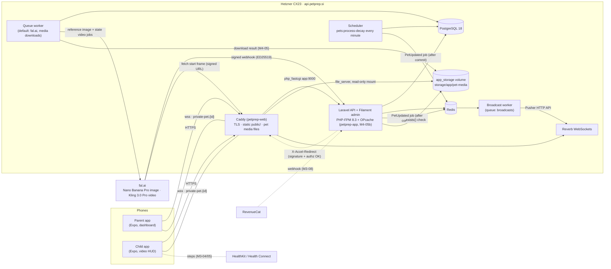

Runtime (M4-05b): every PHP container (app = php-fpm, reverb, queue, queue-broadcasts, scheduler) runs the same image `petprep-app` (code + `composer install --no-dev` baked in, uid 1000, caches built per container on start); Caddy runs `petprep-web` (caddy:2.8-alpine + `public/`). Video bytes never pass through PHP: Laravel only checks the signed URL and answers with an internal `X-Accel-Redirect` header, Caddy serves the file (Range, ETag) from `app_storage` mounted read-only.

## 2. Pairing (parent ↔ child) — legacy e-mail child flow (deprecated since M2-02; new profiles: §2c)

```mermaid
sequenceDiagram
  autonumber
  actor Parent
  actor Child
  participant API as Laravel API
  participant DB as PostgreSQL
  participant Q as Queue
  participant FAL as fal.ai
  Note over Parent: "Dodaj otroka" card (dashboard, or Controls)<br/>shown only while no child is paired
  Parent->>API: POST /api/parent/generate-pin (5/min)
  API->>DB: store 6-digit PIN (15 min, replaces the previous one)
  API-->>Parent: PIN → shown as "734 912" + live countdown + "Nova koda"
  Note over Parent,Child: parent tells the child the PIN<br/>(this child already signed in with e-mail — deprecated; PIN-only login: §2c)
  loop every 5 s while the PIN is valid
    Parent->>API: GET /api/parent/dashboard
  end
  Child->>API: POST /api/child/pair {pin}
  API->>DB: transaction: lock parent, link child,<br/>create UNBORN pet (Pet DNA, born_at null), consume PIN
  API-->>Child: 201 pet (born_at null, awaiting_contract, media_status=pending|disabled)
  API->>Q: GeneratePetReferenceImage (after commit)
  Q->>FAL: fal.run Nano Banana Pro (seed + DNA prompt)
  FAL-->>Q: image URL (*.fal.media)
  Q->>Q: StorePetMedia: download → our disk (M4-05)
  Q->>DB: pet_media image ready, media_status=ready
  Q-->>Child: PetUpdated "reference_image_ready" (Reverb, signed URL)
  Note over Q,FAL: then the entitled state videos — see §10a
  Parent->>API: GET /api/parent/dashboard → pet ≠ null, awaiting_contract
  Note over Parent: "Otrok je povezan!" → GET /api/user refreshes the session pet
  Note over Child,DB: unborn: no decay, hygiene events, day close or escalation;<br/>every child action except the contract → 423 contract_required
  Child->>API: POST /api/child/contract {signature} (Pogodba o odgovornosti)
  API->>DB: transaction: SELECT pet FOR UPDATE, pet_contracts row,<br/>birth: born_at = last_decay_at = last_step_reset_at = now,<br/>metrics 100 %, signed_contract row
  API-->>Child: 201 {status: accepted, state (unlocked)}
  API-->>Parent: PetUpdated "signed_contract" after commit (awaiting_contract false)
  Note over Child,DB: the dog is born — game loop runs from the signing moment (M1-07b)
```

## 2a. Family: second parent and shared pet (M2-01, ADR-012)

```mermaid
sequenceDiagram
  autonumber
  actor Mum as Parent A
  actor Dad as Parent B (new account)
  actor Kid2 as Child 2
  participant API as Laravel API
  participant DB as PostgreSQL
  Mum->>API: POST /api/parent/invite-parent (10/h)
  API->>DB: family_invites: 8-char code, 24 h, single use<br/>(A's previous unused code expires)
  API-->>Mum: 201 {code, expires_at}
  Note over Mum,Dad: code shared outside the app
  Dad->>API: POST /api/parent/join-family {code}
  alt wrong / expired / used code
    API-->>Dad: 422 invalid_code | code_expired | code_used<br/>(5 wrong in 15 min → 429)
  else B already has children or pets
    API-->>Dad: 409 family_not_empty (no merge)
  else ok
    API->>DB: transaction: lock invite, move B into A's family,<br/>delete B's empty family, used_at = now
    API-->>Dad: 200 {family {id, parents, children_count, pets_count}}
  end
  Dad->>API: POST /api/parent/generate-pin {pet_id: Rex}
  API->>DB: PIN on B (15 min), pairing_pet_id = Rex<br/>(Rex must be an active pet of this family, else 422 pet_not_joinable)
  Kid2->>API: POST /api/child/pair {pin}
  API->>DB: transaction: child → family (parent_id mirror = B),<br/>pet_caretakers (Rex, child 2, requires_contract)<br/>partial unique: child has no other active pet
  API-->>Kid2: 201 {joined_existing: true, pet: Rex (born_at unchanged), awaiting_contract: true}
  Kid2->>API: POST /api/child/pet/feed
  API-->>Kid2: 423 contract_required (only for child 2 — child 1 keeps playing)
  Kid2->>API: POST /api/child/contract {signature}
  API->>DB: pet_contracts (Rex, child 2) — no rebirth
  API-->>Kid2: 201 state (unlocked)
  Note over Mum,Kid2: every action stores actor_user_id;<br/>steps per child in pet_daily_steps, the pet's walk = sum;<br/>channel private-pet.{Rex}: both children + both parents
```

## 2b. Mobile app launch — session restore (M1-12) and start screen (M2-02)

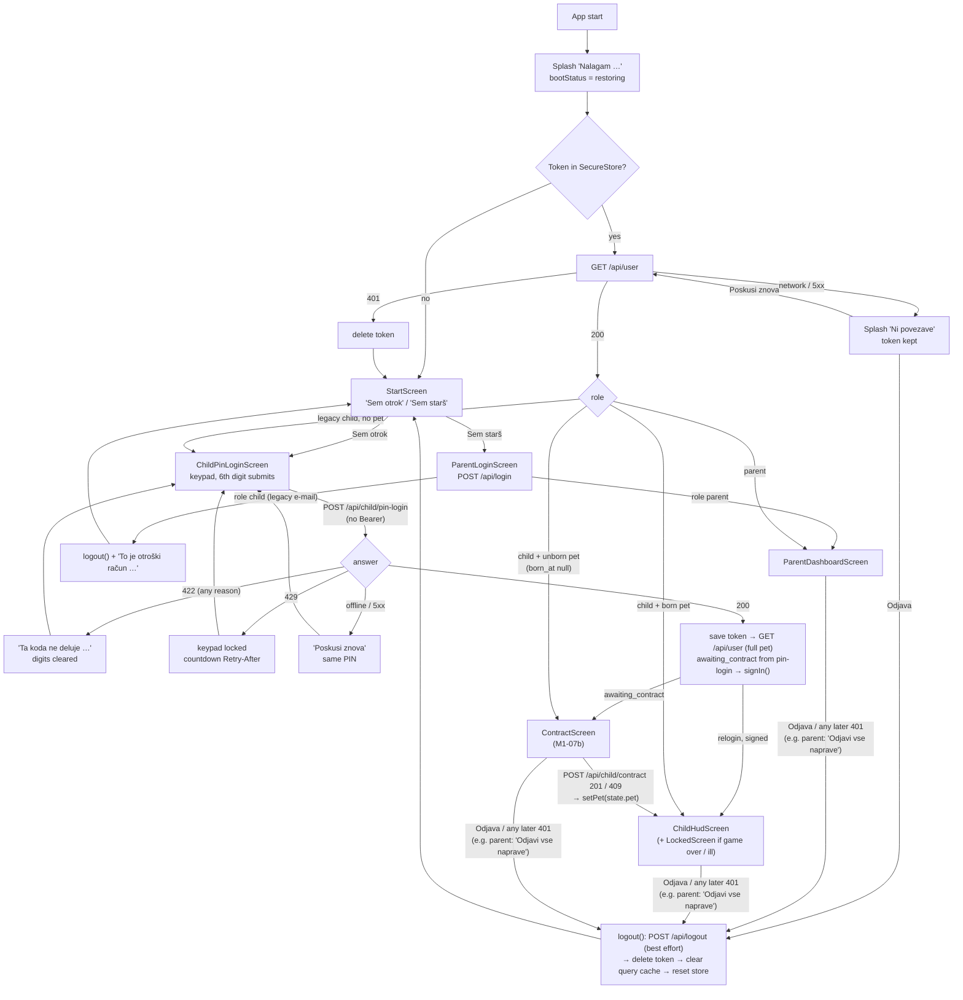

Parent side of §2c in the app: `FamilyChildrenCard` / "Dodaj otroka" → `AddChildScreen`: nickname + optional birth year → `POST /api/parent/children` → "Nov pes" → **"Izberi kužka"** (`DogPickerStep`, M5-R04: breed — premium shown locked —, origin, age at arrival) / "Pridruži se psu …" (no picker) → `POST /api/parent/generate-pin {child_id, pet_id? | breed, origin, age_stage}` (profile all or nothing; 422 `breed_locked` → back to the picker) → PIN + countdown; dashboard polled every 5 s until the child has a pet or one more device → "Otrok je povezan!".

## 2c. PIN-only child login (M2-02 / M2-03)

```mermaid
sequenceDiagram
  autonumber
  actor Parent
  actor Child as Child (own device, no account)
  participant API as Laravel API
  participant DB as PostgreSQL
  Parent->>API: POST /api/parent/children {display_name, birth_year?}<br/>(token ability parent)
  API->>DB: users row: role child, nickname, birth_year,<br/>email NULL, password NULL; family_user (child)
  API-->>Parent: 201 {child {id, …}}
  Parent->>API: POST /api/parent/generate-pin {child_id, pet_id?}
  API->>DB: lock parent → child → family; mode = new_pet | join_pet | relogin;<br/>revoke the child's open PIN; insert child_login_pins<br/>(HMAC-SHA256 of the PIN, 15 min)
  API-->>Parent: {pin "734 912", expires_at, mode}
  Note over Parent,Child: parent tells the child the PIN
  Child->>API: POST /api/child/pin-login {pin, device_name}<br/>(unauthenticated, 10/min per IP)
  alt locked out (≥ 10 failures from this IP or ≥ 100 overall in 15 min)
    API-->>Child: 429 too_many_attempts + Retry-After
  else no open, unexpired PIN with this HMAC
    API->>API: count failure (per IP + global)
    API-->>Child: 422 invalid_pin (same body for wrong / expired / used)
  else match
    API->>DB: transaction: lock parent → child → family → PIN row, re-check
    alt child never paired
      API->>DB: new_pet: create UNBORN pet + caretaker<br/>join_pet: caretaker of the shared pet (requires_contract)
    else child already a caretaker
      Note over API,DB: relogin: nothing re-paired
    end
    API->>DB: PIN consumed_at; token abilities ["child"];<br/>keep the newest 3 tokens of this child
    API-->>Child: 200 {token, user {id, name, role}, mode, pet, awaiting_contract}
  end
  Child->>API: POST /api/child/contract (Bearer, ability child) → birth (M1-07b)
  Parent->>API: DELETE /api/parent/children/{id}/tokens<br/>(lost phone: all devices signed out, open PIN revoked)
```

Token abilities (M2-03): `/api/parent/*` → `ability:parent`, `/api/child/*` → `ability:child`, then the policies (role + family). Tokens issued before M2-02 carry `*` and pass the ability check; the policies still keep the roles apart.

## 2d. Parent self-registration (M2-10a, 2026-10-05)

```mermaid
sequenceDiagram
  autonumber
  actor Parent
  participant App as Mobile app
  participant API as Laravel API
  participant DB as PostgreSQL
  Parent->>App: StartScreen "Sem starš" → ParentLoginScreen<br/>"Nimate računa? Registracija" → ParentSignupScreen
  Parent->>App: name, e-mail, password + repeat, ☑ terms + privacy
  App->>App: validateSignup (same rules as the backend)<br/>timezone = Intl resolvedOptions().timeZone
  App->>API: POST /api/register {name, email, password, password_confirmation,<br/>timezone, accept_terms: true, device_name}<br/>(no Bearer; throttle 5/min + 20/h per IP)
  alt throttled
    API-->>App: 429 + Retry-After → "poskusite znova čez N min"
  else invalid / e-mail taken (lower(email), case-insensitive)
    API-->>App: 422 {errors, codes: {field: code}} → Slovenian message per code
    Note over App,API: timezone_invalid → the app retries ONCE without timezone<br/>(aliases like Etc/UTC, Asia/Calcutta are already canonicalised by the server;<br/>unknown valid zones → Europe/Ljubljana)
  else ok
    API->>DB: transaction: users (role parent, email lower case,<br/>password hash, timezone, terms_accepted_at, terms_version)<br/>lost race on users_email_(lower_)unique → 422 email_taken<br/>→ families (timezone) + family_user (parent)<br/>→ personal_access_tokens (abilities ["parent"])
    API-->>App: 201 {token, abilities, user, pet: null, awaiting_contract: null}
    App->>App: SecureStore token → appStore.signIn()
    App->>API: GET /api/parent/dashboard (ability parent)
    API-->>App: empty family → "Dodaj otroka" (§2c)
  end
```

Not yet (M2-10b): e-mail verification and password reset need a mail provider; `email_verified_at` stays null. Apple / Google sign-in is M2-10c.

## 2e. Account deletion and data export (M2-08, 2026-10-05)

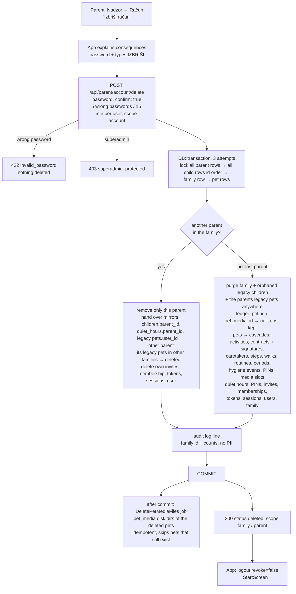

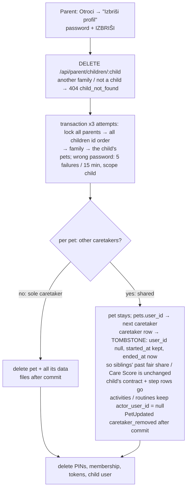

Late work after a deletion is harmless: queued `GeneratePetReferenceImage` / `SubmitPetStateVideo` / `StorePetMedia` find no pet / slot and return (a download that finishes after the deletion removes its file and the pet directory); a late fal webhook matches the ledger row whose slot is gone → **200 "Superseded."**; the decay tick, escalation and routine ledger skip pet ids whose row disappeared under the lock.

```mermaid
sequenceDiagram
  autonumber
  actor Parent
  participant App as Mobile app
  participant API as Laravel API
  Parent->>App: Račun → "Izvozi moje podatke"
  App->>API: GET /api/parent/account/export (throttle 3/h per user)
  alt more than privacy.export_max_rows history rows
    API-->>App: 413 export_too_large
  else ok
    API-->>App: 200 JSON (Content-Disposition: attachment; Cache-Control: no-store)<br/>family, parents, children, quiet hours, invites, pets with history,<br/>contracts incl. signature, scores, signed media URLs (~1 h)<br/>never: password hashes, tokens, PIN hashes, invite codes, fal URLs
    App->>Parent: system share sheet (pretty JSON as text, title petprep-izvoz-DATE.json)
  end
```

## 3. Game loop tick (every minute)


## 4. Escalation & neglect

```mermaid
stateDiagram-v2
  [*] --> Unborn: pairing (PIN)
  Unborn --> OK: contract signed = birth<br/>(born_at = now, metrics 100 %)
  note left of Unborn: waiting for the contract —<br/>no decay, no hygiene events,<br/>no day close, no escalation;<br/>actions 423 contract_required
  OK --> Phase1: displayed hunger / thirst / hygiene ≤ 30 %<br/>(energy is off the ladder: separate daily walk reminder)
  Phase1 --> Phase2: ≤ 10 %
  Phase2 --> Phase3: hunger / thirst / hygiene 0 % for > 1 h<br/>(parent alarm — never from energy)
  Phase1 --> OK: all ≥ 31 %
  Phase2 --> OK: all ≥ 31 %
  Phase3 --> Ill: hygiene 0 % ≥ 6 h<br/>(counted outside quiet hours only)
  OK --> Ill: no walk yesterday (energy showed 0 % at midnight)<br/>→ ill from the end of the night's quiet hours
  Ill --> OK: after 12 h lockout<br/>hygiene 100 %, clocks reset (fresh start)
  Phase3 --> GameOver: hunger / thirst / hygiene 0 % ≥ 24 h
  GameOver --> [*]: parent reset (M2-07)
  note right of Ill: frozen — no decay, no hygiene events,<br/>neglect clocks paused, actions refused.<br/>Recovery: hygiene 100 %, every running<br/>neglect clock restarts at recovery,<br/>hunger / thirst unchanged (David 2026-10-03)
  state HardStop
  OK --> HardStop: parent hard stop
  HardStop --> OK: parent lifts (clocks resume)
```

### Daily walk rule (energy, David 2026-10-03)

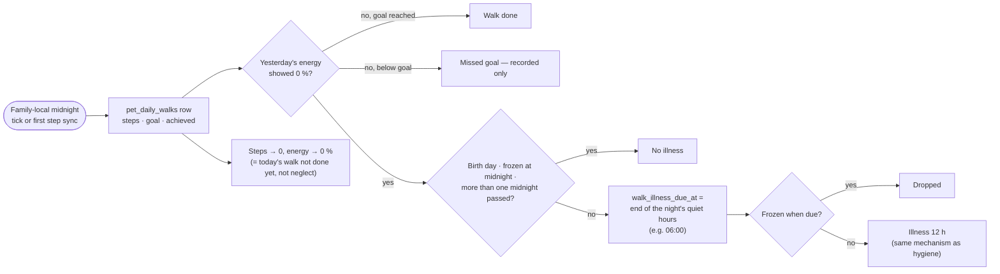

## 5. Child actions (M1-07: `/api/child/pet/*`, `/api/child/contract`)

### 5a. Feed / water / clean / contract

```mermaid
sequenceDiagram
  autonumber
  actor Child
  participant App as Child app
  participant API as ChildPetController
  participant S as PetActivityService
  participant C as CareScheduleService
  participant DB as PostgreSQL
  Child->>App: taps Feed (or Water / Clean / signs contract)
  App->>API: POST /api/child/pet/feed (Bearer, child token)
  API->>API: ChildPetRequest → PetPolicy (child only, else 403)<br/>currentPet() (none → 404 no_pet)
  API->>S: feed(pet)
  S->>DB: BEGIN · SELECT pet FOR UPDATE
  S->>S: illness over? → fresh start (recoverFromIllnessIfDue)
  alt game over / inactive / hard stop / contract required (unborn) / ill
    S-->>API: LOCKED + reason → 423 {reason, locked_until, state}
  else
    S->>S: catch up decay since last tick (PetDecayService::catchUpLocked)
    alt hygiene shows 0 %
      S-->>API: REFUSED needs_cleaning → 422
    else
      S->>C: feeding(pet, breed, now) — windows in family tz,<br/>last fed_pet row in activities_log
      alt outside window / already fed in this window
        S-->>API: REFUSED + next window start → 422 {reason, next_allowed_at}
      else
        S->>DB: hunger 100 %, hunger_zero_since null, pet_state<br/>fed_pet row (value = hunger before)
        S-->>API: ACCEPTED → 200 {status, state}
      end
    end
  end
  S->>DB: COMMIT
  S-->>App: one PetUpdated after commit ("fed_pet",<br/>or "metric_changed" if only the catch-up changed what shows)
  Note over S,C: Water: same flow, CareScheduleService::water —<br/>water_times_per_day per local day, ≥ water_min_gap_minutes real minutes<br/>since the last refill (also across midnight) → thirst 100 %, watered_pet row
  Note over S,DB: Clean: settles due hygiene events, hygiene 100 %, cleaned_poop row (no window).<br/>Contract: allowed while contract_required; once per pet → pet_contracts row + signed_contract row → 201<br/>(unborn pet: birth in the same transaction, M1-07b); again → 409
```

### 5b. Step sync

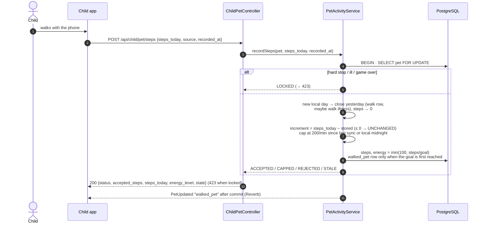

### 5c. Child app: action ↔ cache ↔ Reverb (M1-13 / M1-14 / M1-15 / M1-16)

```mermaid
sequenceDiagram
  autonumber
  actor Child
  participant HUD as ChildHudScreen
  participant Q as TanStack cache ['child','pet']
  participant API as Laravel API
  participant Rev as Reverb (private-pet.{id})
  participant Store as appStore (lock / contract)

  HUD->>API: GET /api/child/pet (useChildPet)
  API-->>Q: state → normalizeChildState (server_time)
  Note over HUD,Rev: wsStatus ≠ connected (not subscribed yet / dropped / 403)<br/>→ refetch every 10 s; connected → no polling
  Child->>HUD: taps Hrani (enabled only if feeding.can_feed)
  HUD->>Q: cancel in-flight GET · optimistic hunger 100 %
  HUD->>API: POST /api/child/pet/feed
  alt 200 accepted / unchanged
    API-->>Q: replace with response.state · toast "Njam! Kuža je sit."
  else 422 refused (outside_feed_window, water_too_soon, needs_cleaning …)
    API-->>Q: replace with error.state (rollback) · toast "Kuža bo lačen spet ob 17:00."<br/>(next_allowed_at in state.timezone)
  else 423 locked (hard_stopped / ill / game_over / inactive / contract_required)
    API-->>Q: replace with error.state
  else offline / 5xx / 429 (no state)
    HUD->>Q: restore previous view · toast "Ni povezave …"
  end
  Rev-->>HUD: .pet.updated {…, emitted_at}
  HUD->>Q: applyBroadcast — drop if emitted_at < last emitted / snapshot;<br/>else metrics + lock flags; non-tick or lock change → refetch GET
  Q-->>Store: lockStateFromView → setLockState(hard_stop | illness | game_over | inactive, until, tz)<br/>awaiting_contract → setAwaitingContract(true)
  Store-->>HUD: AppNavigator: LockedScreen over the HUD (unlocks live) · ContractScreen instead of the HUD
  Note over HUD,Q: timer at the earliest of next window start, current window end,<br/>water next_allowed_at, next family midnight → refetch GET (also while live)
  loop on mount (permission granted), on foreground, every 5 min, on walk overlay close
    HUD->>API: POST /api/child/pet/steps {steps_today, source: pedometer, recorded_at ±HH:MM}<br/>(iOS: CoreMotion since the FAMILY midnight · Android: live counter per child, family day) — only if > my_steps_today of that family day
    API-->>Q: replace with response.state (any status; 423 too)
  end
```

## 6. Data model (core)

Family model (M2-01, ADR-012): `families` own pets and quiet hours; `family_user` puts parents and children in a family; `pet_caretakers` links children to pets (shared pet = several rows). `users.parent_id` and `pets.user_id` are deprecated mirrors.

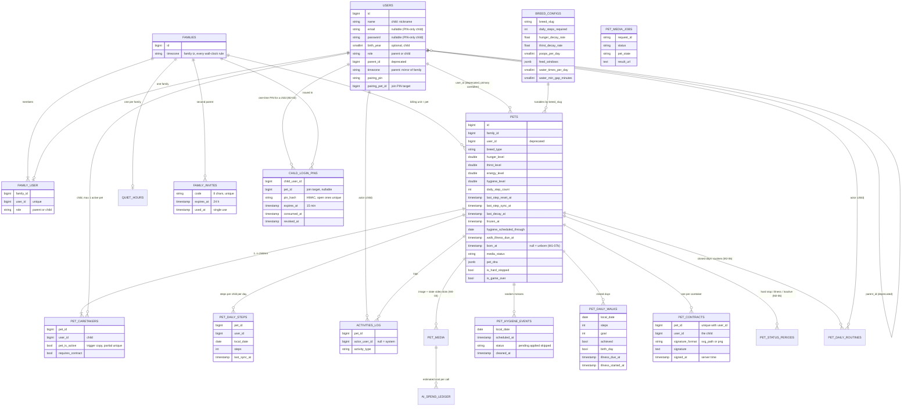

## 7. Delivery pipeline

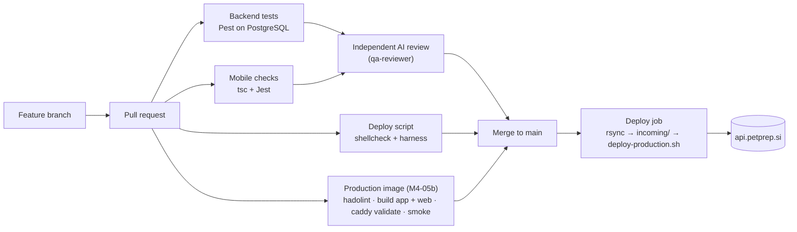

### 7a. deploy-production.sh (M2-01 / PR #24 / M4-05b)

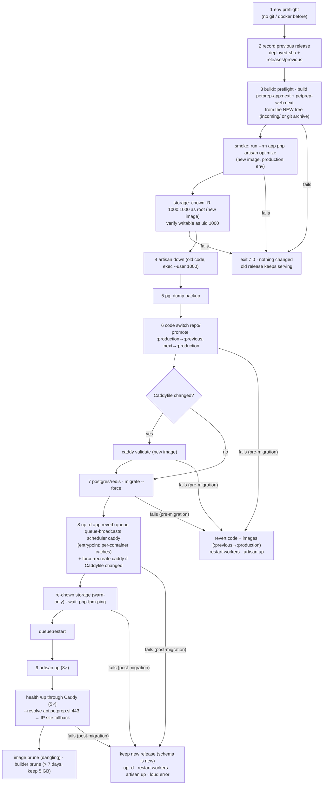

## 8. Real-time delivery (M1-08 private channel, M1-09 queue)

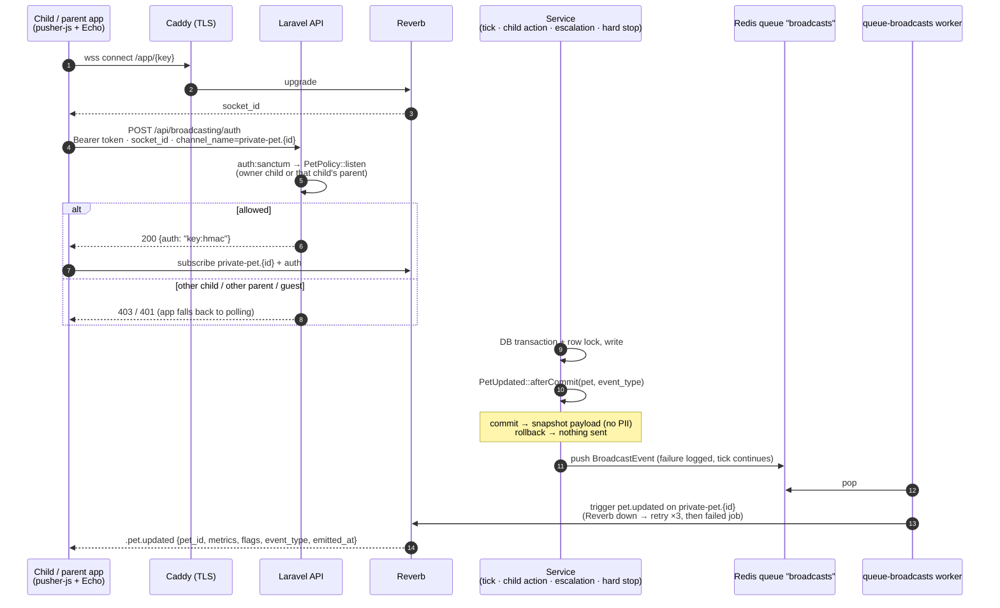

## 9. Routines, Care Score and traffic light (M2-05 / M2-06)

Routines are derived from data the game already writes; finished days are frozen in `pet_daily_routines`, today is computed live with the same code (PRODUCT_SPEC §9 / §11, ARCHITECTURE §4).

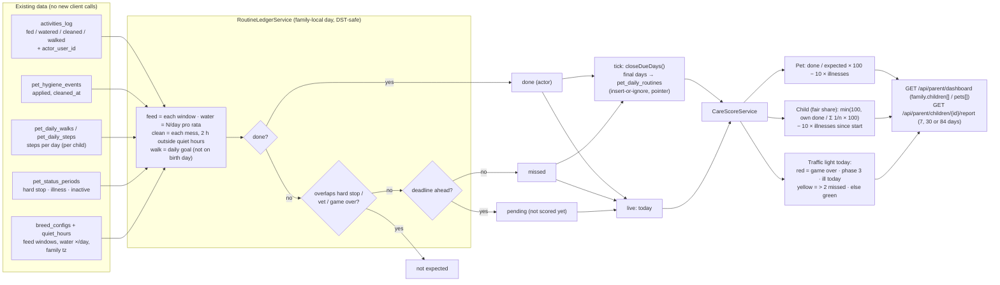

```mermaid
sequenceDiagram
  autonumber
  participant Tick as pets:process-decay (every minute)
  participant Dec as PetDecayService
  participant Esc as EscalationService
  participant Led as RoutineLedgerService
  participant DB as PostgreSQL

  Tick->>Dec: decay + hygiene events + midnight close (walk row)
  Tick->>Esc: phases, illness, game over<br/>(Pet hooks write pet_status_periods)
  Tick->>Led: closeDueDays()
  Led->>DB: pets WHERE routines_next_close_at ≤ now (or never closed)
  loop each due pet
    Led->>DB: batch-load activities, events, walks, steps, periods, quiet hours
    Led->>Led: compute days after routines_closed_through … yesterday
    alt a day still has a pending routine (e.g. 21:30 mess due 07:30)
      Led->>DB: rows of the final days + pointer, next = that deadline
    else all final
      Led->>DB: rows (insert-or-ignore) + pointer, next = next local midnight
    end
  end
```

## 9a. Parent app on real data (M2-05 mobile)

The parent app reads only server results (no scoring on the phone). Live events patch the cached dashboard; anything other than a decay tick refetches the computed parts; without a subscribed channel the dashboard polls every 30 s.

```mermaid
sequenceDiagram
  autonumber
  participant UI as ParentDashboardScreen (light)
  participant Q as TanStack cache
  participant API as Laravel API
  participant Rev as Reverb (private-pet.{id})

  UI->>Q: useParentDashboard (['parent','dashboard'])
  Q->>API: GET /api/parent/dashboard
  API-->>Q: family.children[] {traffic_light, care_score, today, last_7_days, progress}<br/>family.pets[] {metrics, flags, timeline}
  Q-->>UI: one ChildOverviewCard per child
  UI->>Rev: ParentLiveChannels: ONE connection, a private channel per active pet (status per pet)
  alt every pet channel subscribed (wsStatus = connected)
    Rev-->>Q: .pet.updated metric_changed → patch metrics / flags (refetch ≤ 1× per 60 s)
    Rev-->>Q: .pet.updated fed_pet, hard_stop_*, illness_triggered … → patch + invalidate dashboard, activities, reports
    Q->>API: GET /api/parent/dashboard (refetch)
    loop every 3 min while live (deadlines pass without events)
      Q->>API: GET /api/parent/dashboard
    end
  else any pet channel down / reconnecting
    loop every 30 s (paused in background)
      Q->>API: GET /api/parent/dashboard
    end
  end
  UI->>API: "Podrobnosti" → GET /api/parent/children/{id}/report?days=7|30|84
  UI->>API: timeline → GET /api/parent/activities?pet_id=&page=1,2,… ("Naloži več")
  UI->>UI: Nadzor → hard stop: in-app confirmation
  UI->>API: POST /api/parent/hard-stop {pet_id, active: confirmed intent} (idempotent set)
  API-->>Q: {pet_id, is_hard_stopped} → cache, then refetch
  UI->>API: POST /api/parent/invite-parent → code → system share sheet
  UI->>API: POST /api/parent/join-family {code} (only while own family is empty)
```

## 10. AI media pipeline — profiles, spend caps, DNA v2, AI Lab (M4-02 / M4-07 / M4-08)

```mermaid
flowchart TD
  subgraph Birth["Pairing (one DB transaction, family row locked)"]
    P[PairingService::createPet] --> D{AI_PET_DNA_VERSION}
    D -- 2 --> V2["PetDnaService::forNewPet<br/>seed = crc32(pet id + salt)<br/>traits from config/breed_appearance.php<br/>unique trait combo per family + breed"]
    D -- 1 --> V1[FalAiService::generateInitialPetDna]
    V2 --> PR["prompt = breed + traits + photo style<br/>(no names, no personal data)"]
    PR --> J[[GeneratePetReferenceImage<br/>dispatched after commit]]
    V1 --> J
  end

  subgraph Lab["Filament /admin/ai-lab (superadmin)"]
    L1["Image run: breed, fixed traits,<br/>1-4 samples x image profiles"] --> LE{"estimate within AI_LAB_MAX_RUN_USD<br/>and remaining budget?"}
    L2["Video run: lab image x video profiles x state"] --> LE
    LE -- no --> LR[notification: not started]
    LE -- yes --> LJ[["RunMediaLabImage / SubmitMediaLabVideo<br/>one job per call"]]
  end

  J --> G
  LJ --> G
  G["FalGateway (only fal HTTP client)<br/>LogicException inside a DB transaction<br/>profile from config/media.php"] --> R{"AiSpendGuard::reserve<br/>advisory lock, own short transaction<br/>pets budget or separate lab budget<br/>today + month (reserved + committed)"}
  R -- over cap --> X1["AiCallException budget_daily / budget_monthly<br/>no HTTP; pet: media_status failed + media_error"]
  R -- "ok: ledger row reserved" --> H["HTTP outside any transaction<br/>sync: fal.run/endpoint (images)<br/>queue: queue.fal.run/endpoint + fal_webhook (videos)"]
  H -- 2xx --> C[ledger committed]
  H -- "402 / 403 exhausted balance" --> B["ledger void, fal_balance<br/>Log::critical once per hour<br/>Filament flag 24 h"]
  H -- "4xx/5xx answer or not sent (DNS / connect / TLS)" --> E["ledger void, http_error<br/>reference image: queue retry"]
  H -- "timeout / reset after sending" --> T["ledger committed + http_error (cost kept)<br/>lab video: status unknown"]
  X1 -.-> RT["daily media:retry<br/>(budget / balance: images, then videos) + Filament Retry image"]
  S2 -.-> SW["hourly media:sweep-lab: running > 1 h → timed_out"]
  C --> S1["image url (*.fal.media) → pet_media image slot → StorePetMedia / lab result"]
  C --> S2["request_id → pet_media / media_lab_results"]
  S2 -.-> W["POST /api/webhooks/fal-ai (ED25519, fail closed)<br/>pet_media → StorePetMedia (§10a)<br/>else media_lab_results → lab gallery"]
  S2 -.-> PL["AI Lab 'Check pending' → PollMediaLabResult<br/>(free status read, queue.fal.run only)"]
  C --> WG["Filament AiSpendOverview: today / month vs caps, fal balance"]
```

## 10a. Pet media at birth + own storage (M4-03 / M4-05, 2026-10-05)

```mermaid
sequenceDiagram
  autonumber
  participant Pair as Pairing (transaction)
  participant Q as Queue worker
  participant FAL as fal.ai
  participant API as Laravel API
  participant DB as PostgreSQL
  participant Disk as pet-media disk (app_storage)
  participant App as Child / parent app
  Pair->>Q: GeneratePetReferenceImage (after commit)
  Q->>DB: claim image slot pending → running
  Q->>FAL: fal.run nano-banana-pro (DNA v2 prompt, seed) — budget reserve first
  FAL-->>Q: images[0].url (*.fal.media, allowlisted)
  Q->>DB: slot.source_url, ledger committed ($0.15)
  Q->>FAL: StorePetMedia: GET url (≤ 25 MB, finfo jpeg/png/webp, ≤ 3 allowlisted redirects)
  Q->>Disk: {pet}/reference-g1.jpg
  Q->>DB: slot ready, pets.media_status = ready
  Q-->>App: PetUpdated reference_image_ready (media.reference_image_url signed)
  Note over Pair,Q: videos only once the pet is born:<br/>first contract → signContract → queueStateVideos (after commit)<br/>(image stored first? then StorePetMedia queues them)
  Q->>DB: queueStateVideos: slots per MediaEntitlementService<br/>(mutt: idle + sleeping · premium breed: all 6)
  loop each entitled state
    Q->>DB: SubmitPetStateVideo: claim slot
    Q->>FAL: queue.fal.run kling-video/v3/pro/image-to-video<br/>start_image_url = our signed URL (6 h), 5 s, no audio, fal_webhook
    FAL->>API: GET /api/media/{image}?signature (start frame)
    FAL-->>Q: request_id → slot (ledger $0.56)
    FAL->>API: POST /api/webhooks/fal-ai (ED25519)
    API->>DB: lock slot by request_id, source_url (idempotent)
    API->>Q: StorePetMedia (after commit)
    Q->>FAL: GET video (≤ 60 MB, video/mp4)
    Q->>Disk: {pet}/{state}-g1.mp4
    Q->>DB: slot ready
    Q-->>App: PetUpdated video_ready (media.videos, current_video_url)
  end
  App->>API: GET /api/media/{id}?expires&v&signature (Range) — via Caddy → PHP-FPM
  API-->>App: 403 expired / tampered / other family token · 404 no stored file
  Note over API,Disk: production (PET_MEDIA_SERVE_VIA=caddy, M4-05b): PHP answers 200 + empty body +<br/>X-Accel-Redirect: /{pet}/{file} (path checked against a strict pattern);<br/>Caddy handle_response serves the file from /srv/storage/app/pet-media (read-only):<br/>200 / 206 / 304, Content-Type + Cache-Control private copied, nosniff — the header never reaches the app.<br/>Local dev / tests (php): BinaryFileResponse straight from PHP.
```

```mermaid
flowchart LR
  F{"failure"} --> B["budget / fal balance / disabled"] --> BF["slot failed + reason<br/>pet playable without media"] --> RT["daily media:retry (00:23 UTC)<br/>within budget: images, then videos"]
  F --> N["fal 5xx / network before acceptance"] --> QR["queue retry 30 s · 2 min · 10 min"] --> GF["failed http_error"]
  F --> T["submit timed out after sending"] --> TK["failed http_error, cost kept"]
  F --> E["webhook ERROR / non-fal URL"] --> EF["failed generation_failed / invalid_response"]
  F --> D["download 4xx / too big / wrong type"] --> DF["failed invalid_response<br/>(image: fal URL forgotten)"]
  F --> L["lost webhook / job / worker"] --> SW["hourly media:sweep:<br/>2 h → timed_out · re-queue download · reclaim after 10 min"]
  GF & TK & EF & DF & SW -.-> AD["media:backfill / Filament Generate missing / Regenerate"]
```

## 10b. App playback of pet media (M4-03 app side, 2026-10-05)

```mermaid
flowchart TD
  P["media from GET /api/child/pet · pet.updated · dashboard"] --> N["normalizePetMedia"]
  N --> W{"videoStateFor(pet_state, lock)"}
  W -- "game_over / inactive / contract" --> IMG
  W -- "ill → sick · hard stop → sleeping · else pet_state" --> V1{"videos[state]?"}
  V1 -- yes --> PLAY["video layer (key = path + v)"]
  V1 -- no --> V2{"videos.idle?"} -- yes --> PLAY
  V2 -- no --> V3{"no videos map and current_video_url?"} -- yes --> PLAY
  V3 -- no --> IMG{"reference image?"} -- yes --> I["image (useStableUrl)"]
  IMG -- no --> PH["placeholder (HUD avatar / paw + breed)"]
  PLAY --> R{"first frame?"} -- yes --> X["300 ms crossfade, old player released"]
  PLAY --> E{"player error"} -- first --> RF["keep last frame + refetch state once → re-signed URL → retry"]
  E -- second --> CD["failed 60 s (image / idle) → one more try"] -- fails --> I
  W -. "vet / hard stop" .-> GREY["video keeps playing under the translucent grey lock"]
```

```mermaid
sequenceDiagram
  participant S as Server (poll / broadcast)
  participant V as PetMediaView
  participant A as layer A (idle, playing)
  participant B as layer B (hungry)
  S->>V: same idle file, new signature
  Note over V,A: mediaKey unchanged → nothing happens (no restart)
  S->>V: pet_state hungry
  V->>B: mount hidden, useVideoPlayer(url)
  B-->>V: onFirstFrameRender (or readyToPlay + 1 s)
  V->>B: fade in 300 ms
  V->>A: unmount → player released
  S->>V: pet_state idle again during B's 300 ms fade-in
  V->>B: stop fade-in, fade out (leaving) → released
  V->>A: (still mounted) back to opacity 1
  Note over V: AppState background / opaque lock (game over, inactive) / walk → pause · foreground → play
```

## 10c. "Moj kuža" album: HUD → album → viewer (2026-10-05, PR #31)

```mermaid
flowchart TD
  M["pet.media (child state / parent dashboard)"] --> B["buildAlbumItems"]
  B --> E{"anything stored, or status pending / partial?"}
  E -- "no (disabled / failed)" --> NB["no album button · empty album"]
  E -- yes --> T["photo + one tile per entitled state (media.states)"]
  T --> T1["stored → playable tile"]
  T --> T2["entitled, not stored → grey 'Še ni posnetka'"]
  T --> T3["not entitled → hidden"]
  HUD["Child HUD header: album button"] -->|"isAlbumVisible"| G["PetAlbum grid (no players)"]
  PD["Parent child detail: 'Vsi posnetki kužka' (read-only)"] --> G
  HUD -. "HUD video paused · HUD hidden from a11y" .-> G
  G -->|"tap playable tile"| VW["viewer: photo or ONE looping video (muted + sound toggle, cache)"]
  VW -->|"arrows / swipe (wrap)"| VW
  VW -->|"back / Android back"| G
  G -->|"X / Android back"| C["close → HUD video resumes"]
  L["lock starts / HUD unmounts"] -->|"isAlbumVisible = false (no reopen on unlock)"| C
  VW --> ER{"load error"}
  ER -->|"useStableUrl: newer URL of same file"| VW
  ER -->|"else"| UN["'Posnetka trenutno ni mogoče predvajati.' + 'Poskusi znova'"]
  UN -->|"refetch once per media, again after 5 min"| RF["onMediaExpired → refetch state"]
  X["1 min before media.expiresAt (album open)"] --> RF
  RF -->|"re-signed URLs"| VW
```

## 11. Push notifications (M3-02, 2026-10-05)

### 11a. Escalation → push

```mermaid
sequenceDiagram
  autonumber
  participant T as pets:process-decay (every minute)
  participant E as EscalationService (pet row locked)
  participant N as NotificationService
  participant F as FamilyService
  participant DB as push_notifications
  participant Q as queue "notifications"
  participant J as SendPushNotification
  participant X as Expo Push API
  participant P as Phones (APNs / FCM)
  T->>E: escalate pet (one step per tick)
  E->>E: level up → activities_log + PetUpdated::afterCommit
  E->>N: escalation(pet, type, metric)
  N->>F: phase 1/2 → caretakerRecipients · phase 3 → parentRecipients · illness / game over → both
  Note over N: energy ≤ 30 % (outside quiet hours) → walkReminder(): separate, 1 per local day, not a phase
  alt PUSH_ENABLED=false
    N-->>E: nothing (no row)
  else same pet+type within 30 min (walk: same day) · nobody to reach · quiet hours (phase 1/2/3)
    N->>DB: status suppressed (+ reason) — never sent later
  else quiet hours (illness / game over) · walk before last quiet end + 2 h
    N->>DB: status scheduled, send_after (push:dispatch-scheduled queues it when due)
  else
    N->>DB: status queued (uuid idempotency key, recipient ids only)
    N->>Q: dispatch after commit
  end
  Q->>J: run (unique per notification, 5 tries, backoff 10/30/60/180 s)
  J->>J: still queued? pet locked (not illness/game over) / walk done → suppressed; quiet or too early → held again
  J->>X: POST /push/send, ≤ 100 messages {to, title "PetPrep", body (sl), data {type, pet_id}, priority, channelId, ttl}
  alt PUSH_TOO_MANY_EXPERIENCE_IDS
    X-->>J: tokens per Expo project → one request per project
  else connection / 429 / 5xx
    X-->>J: error → retry (devices with a ticket are skipped)
  else other 4xx
    X-->>J: rejected → failed (no retry)
  else ok
    X-->>J: one ticket per message
    J->>DB: push_tickets (unique notification+device) · status sent
    J->>J: ticket DeviceNotRegistered → device disabled
    X->>P: deliver (Android channel "alarm" for phase 2+)
  end
```

### 11b. Receipts, devices and cleanup

```mermaid
flowchart LR
  S["push:receipts<br/>7,22,37,52 * * * *"] --> CJ["CheckPushReceipts (queue notifications)"]
  CJ --> R{"tickets 15 min – 24 h old,<br/>no receipt yet"}
  R --> GR["POST /push/getReceipts (≤ 1000 ids)"]
  GR -->|"DeviceNotRegistered"| DIS["device_push_tokens.disabled_at"]
  GR -->|"ok / other error"| OK["receipt stored"]
  S --> PR["delete push rows older than 30 days"]
  REG["POST /api/devices (login, app start, token rotation)"] -->|"upsert by token; re-enables;<br/>moves to the account that registered last"| DEV["device_push_tokens"]
  DEV -.->|"FK cascade"| PAT["personal_access_tokens<br/>(logout · revoke all · prune 4th device)"]
  DEL["POST /api/devices/unregister {expo_push_token} (logout)"] --> DEV
  DS["push:dispatch-scheduled (every minute)"] -->|"scheduled → queued when send_after passed"| CJ2["SendPushNotification"]
  ACC["child / parent account deleted"] --> DEV
```

### 11c. App side

```mermaid
flowchart TD
  SI["sign-in / session restore"] --> AL{"notifications already allowed?"}
  AL -- no --> W["wait for a good moment"]
  AL -- yes --> REG["Android channels default + alarm → Expo token (EAS projectId) → POST /api/devices → token in SecureStore"]
  W --> C0["first dashboard / HUD view of the session"]
  C0 --> PP
  W --> C1["child: contract signed (pet born)"]
  W --> C2["parent: child profile created"]
  C1 --> PP["Slovenian pre-prompt (Alert)"]
  C2 --> PP
  PP -- "Ne zdaj" --> D3["remember 3 days"]
  PP -- "Dovoli obvestila" --> SYS["system permission prompt"]
  SYS -- allowed --> REG
  SYS -- "don't allow" --> END["never asked again (settings)"]
  TAP["push tapped (live or cold start, once)"] --> RO{"role"}
  RO -- child --> HUD["close album, refetch ['child','pet'] → HUD"]
  RO -- parent --> PT["store.pushTarget = {petId} → dashboard opens that child's detail"]
  NZ["Nadzor → Obvestila"] -->|"off"| SYS
  NZ -->|"blocked"| SET["phone settings"]
  LO["logout"] --> UN["POST /api/devices/unregister (≤ 2 s) → POST /api/logout (≤ 5 s)"]
```

## 12. Pet profile and life stages (M5-R01, 2026-10-05)

### 12a. Creation: parent's choice → PIN → pet

```mermaid
sequenceDiagram
  participant P as Parent app
  participant API as Laravel API
  participant DB as PostgreSQL
  participant C as Child app
  P->>API: POST /api/parent/generate-pin {child_id, breed?, origin?, age_stage?}
  API->>API: GeneratePinRequest (enums; profile not with pet_id)<br/>premium breed → 422 breed_locked
  API->>DB: child_login_pins (+ pet_options {breed, origin, age_stage})
  API-->>P: {pin, mode: new_pet, pet_profile}
  C->>API: POST /api/child/pin-login {pin}
  API->>DB: breed_stage_params → arrival age (puppy 2 · young 9 · adult 36 · senior 108/118)
  API->>DB: pets (unborn, origin, arrival_age_months, life_stage)
  API-->>C: pet {…, profile}
  C->>API: POST /api/child/contract → birth (age clock starts)
```

### 12b. Rules of a day (LifeStageService::rulesOn)

```mermaid
flowchart TD
  D["family-local date"] --> A["age at local midnight = arrival_age_months + completed weeks since born_at<br/>(7 local days at the birth's wall-clock time)"]
  A --> S["stage = last starts_at_months ≤ age<br/>(puppy 0 · young 9 · adult 36 · senior 108 / 118)"]
  S --> M["meals_per_day: band of the stage with greatest from ≤ age<br/>(puppy 0 → 4 · 3 → 3 · 6 → 2; young/adult/senior 2)"]
  M --> W{"feed_windows row of the same band?"}
  W -- yes --> W1["4: 07–09 · 11–13 · 15–17 · 19–21<br/>3: 07–09 · 13–15 · 19–21 (2 h, David 2026-10-05)"]
  W -- "no, breed windows match the count" --> W2["breed_configs.feed_windows 06–10 · 17–21"]
  W -- "no, mismatch" --> W3["N derived 2-h windows 07:00…19:00 (logged)"]
  S --> E["exercise minutes: puppy/young 10 × age, capped at adult<br/>adult: BC 120 · mutt 60 · senior 75 %"]
  E --> G["step goal = minutes × 100 (cap: breed_configs.daily_steps_cap)"]
  W1 & W2 & W3 --> Q{"window entirely in quiet hours?"}
  Q -- yes --> PC["parent covers it: tick feeds at start (parent_fed_pet),<br/>never a child routine"]
  Q -- no --> CR["child's feed routine (ledger)"]
  G --> EN["energy = steps / goal · walk routine · pet_daily_walks.goal"]
```

### 12b-2. David's decisions → existing production rows (M5-R01b, one-off migration)

```mermaid
flowchart TD
  R["28 TARGETS frozen in the migration<br/>(= seeder rows with decision 'potrdil David 2026-10-05')"] --> T{"tuple has any<br/>breed_stage_param_changes row?"}
  T -- "yes (admin edit / re-key / delete)" --> SK1["skip — Filament wins"]
  T -- no --> X{"row exists?"}
  X -- "no (fresh DB)" --> SK2["skip — seeder inserts the confirmed row"]
  X -- yes --> V{"value = PR #37 value<br/>or confirmed value?"}
  V -- no --> SK3["skip + warning (changed outside Filament)"]
  V -- yes --> D{"any column differs?"}
  D -- no --> SK4["nothing (idempotent)"]
  D -- yes --> U["UPDATE value / verified = true / notes / data_ref<br/>+ audit row: updated, user_id null,<br/>actor 'system: David decision 2026-10-05'"]
  U --> C["forget LifeStageService cache → profile.data_verified = true"]
```

### 12c. Stage transition and stage images

```mermaid
sequenceDiagram
  participant T as pets:process-decay (tick, row lock)
  participant J as RegeneratePetStageMedia (queue)
  participant MS as PetMediaService
  participant FAL as fal.ai (Nano Banana Pro Edit)
  T->>T: syncStage(): rules of today → life_stage puppy → young
  T-->>J: dispatch after commit (once — lock + ShouldBeUnique)
  J->>MS: startStageTransition(pet)
  MS->>MS: image slot in flight → busy (release 10 min)<br/>already this stage → up_to_date
  MS->>MS: archive stored image → pet_media_history (file kept)
  MS->>MS: reset slot (generation + 1) → GeneratePetReferenceImage
  MS->>FAL: edit {image_urls: [our signed URL of the old image], prompt: same dog, now <stage cue>, seed}
  Note over MS,FAL: edit profile off → text-to-image, same seed + DNA traits + stage/origin cues
  FAL-->>MS: images[0].url → StorePetMedia (new file, old one kept)
  MS->>MS: queueStateVideos(): entitled videos regenerated (older source generation)
```
