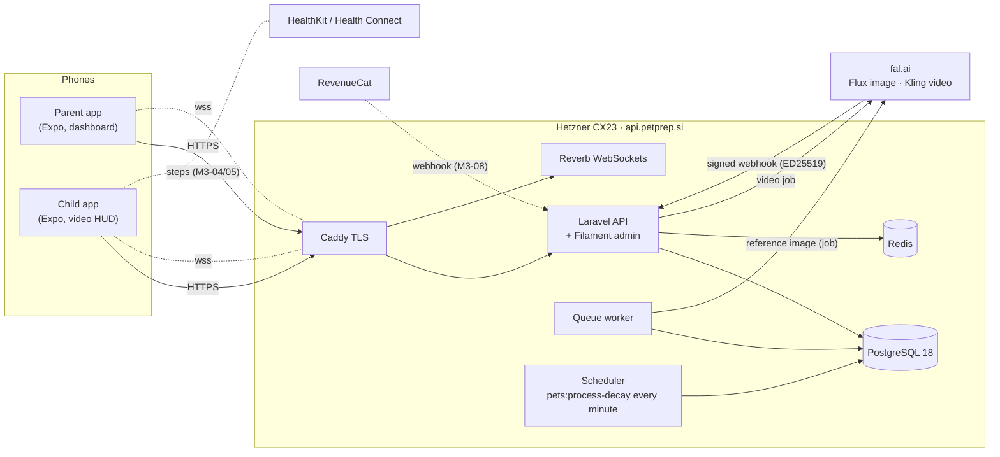
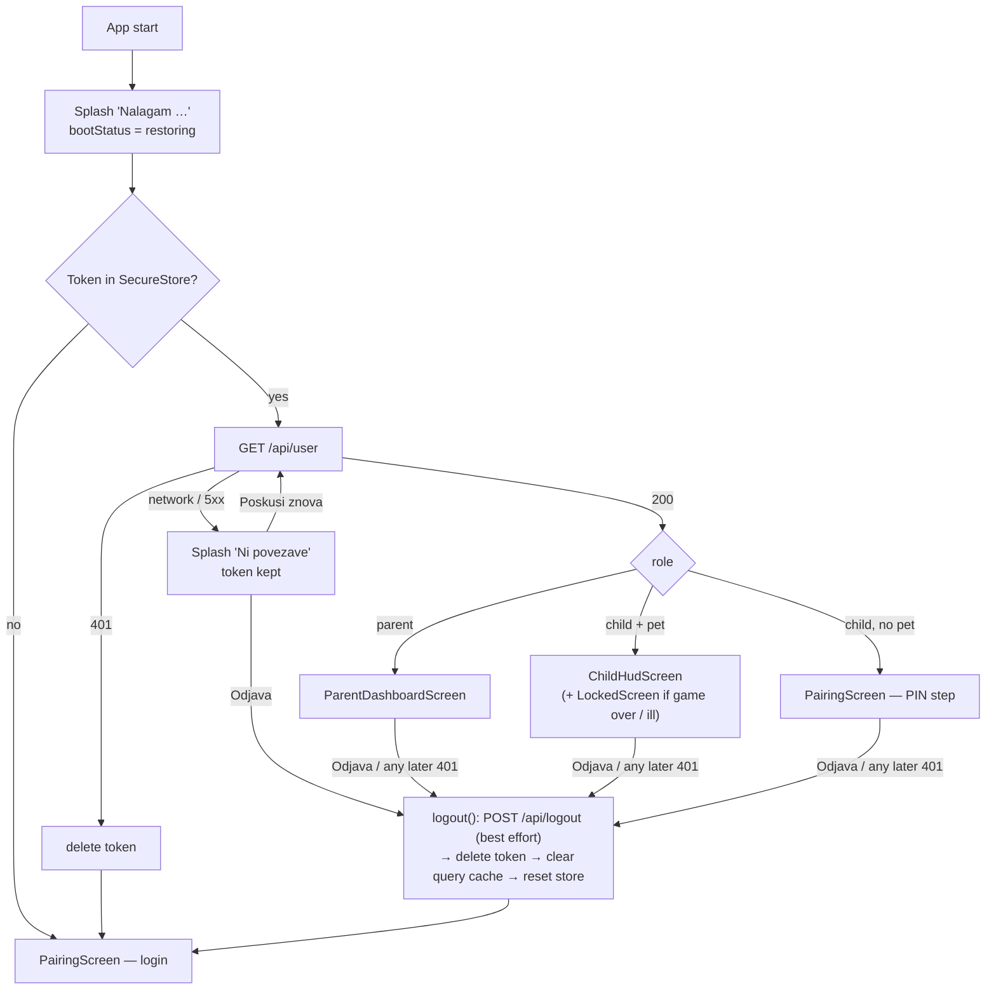
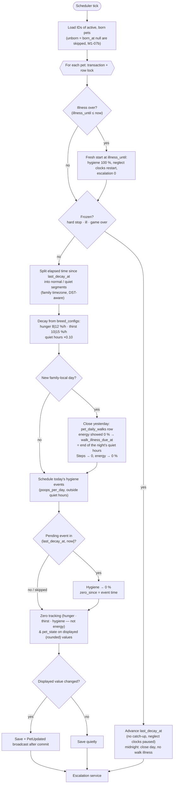
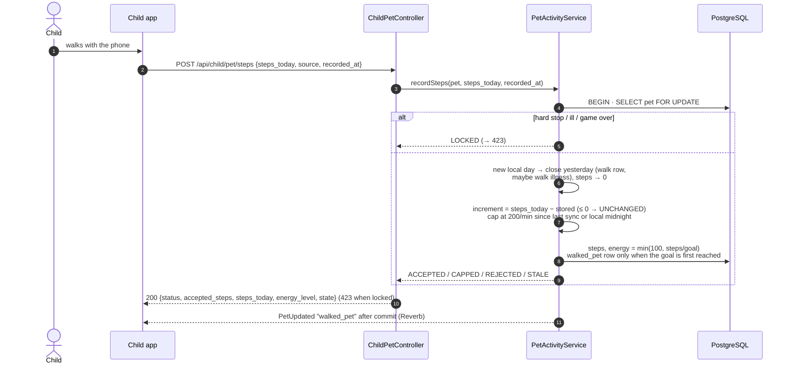
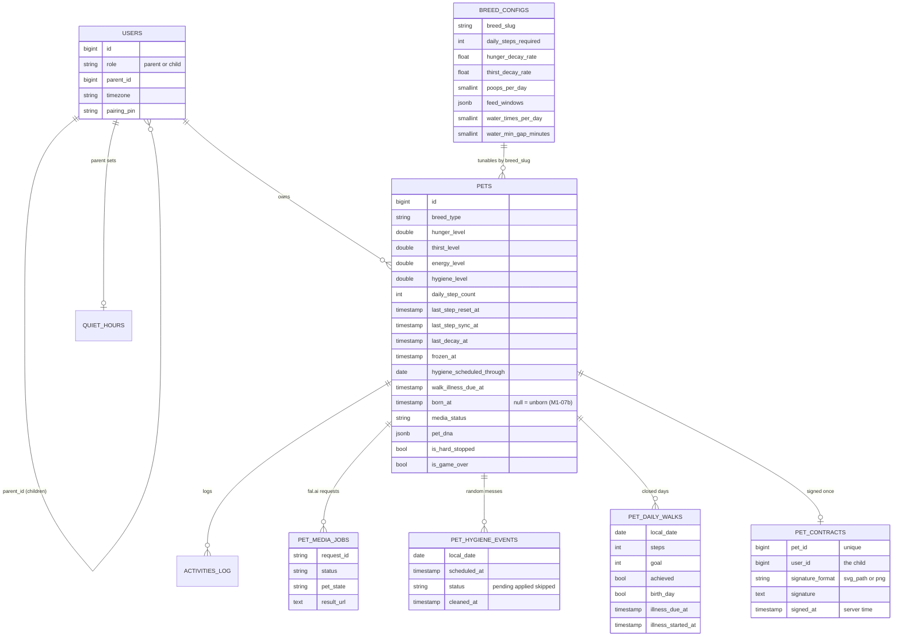
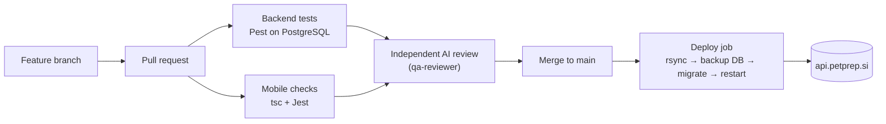

# PetPrep — Diagrams (Mermaid)

Living diagrams of the system **as built**. Update in the same PR as the code. GitHub renders Mermaid natively; export to PNG/SVG for decks with `npx @mermaid-js/mermaid-cli -i DIAGRAMS.md`.

Legend: solid = built and deployed · dashed = planned (roadmap ID in label).

## 1. System context



## 2. Pairing (parent ↔ child)

```mermaid
sequenceDiagram
  autonumber
  actor Parent
  actor Child
  participant API as Laravel API
  participant DB as PostgreSQL
  participant Q as Queue
  participant FAL as fal.ai
  Note over Parent: "Dodaj otroka" card (dashboard, or Controls)<br/>shown only while no child is paired
  Parent->>API: POST /api/parent/generate-pin (5/min)
  API->>DB: store 6-digit PIN (15 min, replaces the previous one)
  API-->>Parent: PIN → shown as "734 912" + live countdown + "Nova koda"
  Note over Parent,Child: parent tells the child the PIN<br/>(child still signs in with e-mail first — PIN-only login is M2-02)
  loop every 5 s while the PIN is valid
    Parent->>API: GET /api/parent/dashboard
  end
  Child->>API: POST /api/child/pair {pin}
  API->>DB: transaction: lock parent, link child,<br/>create UNBORN pet (Pet DNA, born_at null), consume PIN
  API-->>Child: 201 pet (born_at null, awaiting_contract, media_status=pending|disabled)
  API->>Q: GeneratePetReferenceImage (after commit)
  Q->>FAL: fal.run Flux (seed + prompt anchor)
  FAL-->>Q: image URL (*.fal.media)
  Q->>DB: pet_dna.reference_image_url, media_status=ready
  Q-->>Child: PetUpdated "reference_image_ready" (Reverb)
  Parent->>API: GET /api/parent/dashboard → pet ≠ null, awaiting_contract
  Note over Parent: "Otrok je povezan!" → GET /api/user refreshes the session pet
  Note over Child,DB: unborn: no decay, hygiene events, day close or escalation;<br/>every child action except the contract → 423 contract_required
  Child->>API: POST /api/child/contract {signature} (Pogodba o odgovornosti)
  API->>DB: transaction: SELECT pet FOR UPDATE, pet_contracts row,<br/>birth: born_at = last_decay_at = last_step_reset_at = now,<br/>metrics 100 %, signed_contract row
  API-->>Child: 201 {status: accepted, state (unlocked)}
  API-->>Parent: PetUpdated "signed_contract" after commit (awaiting_contract false)
  Note over Child,DB: the dog is born — game loop runs from the signing moment (M1-07b)
```

## 2b. Mobile app launch — session restore (M1-12)



## 3. Game loop tick (every minute)



## 4. Escalation & neglect

```mermaid
stateDiagram-v2
  [*] --> Unborn: pairing (PIN)
  Unborn --> OK: contract signed = birth<br/>(born_at = now, metrics 100 %)
  note left of Unborn: waiting for the contract —<br/>no decay, no hygiene events,<br/>no day close, no escalation;<br/>actions 423 contract_required
  OK --> Phase1: displayed metric ≤ 30 %<br/>(energy only outside quiet hours)
  Phase1 --> Phase2: ≤ 10 %
  Phase2 --> Phase3: hunger / thirst / hygiene 0 % for > 1 h<br/>(parent alarm — never from energy)
  Phase1 --> OK: all ≥ 31 %
  Phase2 --> OK: all ≥ 31 %
  Phase3 --> Ill: hygiene 0 % ≥ 6 h<br/>(counted outside quiet hours only)
  OK --> Ill: no walk yesterday (energy showed 0 % at midnight)<br/>→ ill from the end of the night's quiet hours
  Ill --> OK: after 12 h lockout<br/>hygiene 100 %, clocks reset (fresh start)
  Phase3 --> GameOver: hunger / thirst / hygiene 0 % ≥ 24 h
  GameOver --> [*]: parent reset (M2-07)
  note right of Ill: frozen — no decay, no hygiene events,<br/>neglect clocks paused, actions refused.<br/>Recovery: hygiene 100 %, every running<br/>neglect clock restarts at recovery,<br/>hunger / thirst unchanged (David 2026-10-03)
  state HardStop
  OK --> HardStop: parent hard stop
  HardStop --> OK: parent lifts (clocks resume)
```

### Daily walk rule (energy, David 2026-10-03)


## 5. Child actions (M1-07: `/api/child/pet/*`, `/api/child/contract`)

### 5a. Feed / water / clean / contract

```mermaid
sequenceDiagram
  autonumber
  actor Child
  participant App as Child app
  participant API as ChildPetController
  participant S as PetActivityService
  participant C as CareScheduleService
  participant DB as PostgreSQL
  Child->>App: taps Feed (or Water / Clean / signs contract)
  App->>API: POST /api/child/pet/feed (Bearer, child token)
  API->>API: ChildPetRequest → PetPolicy (child only, else 403)<br/>currentPet() (none → 404 no_pet)
  API->>S: feed(pet)
  S->>DB: BEGIN · SELECT pet FOR UPDATE
  S->>S: illness over? → fresh start (recoverFromIllnessIfDue)
  alt game over / inactive / hard stop / contract required (unborn) / ill
    S-->>API: LOCKED + reason → 423 {reason, locked_until, state}
  else
    S->>S: catch up decay since last tick (PetDecayService::catchUpLocked)
    alt hygiene shows 0 %
      S-->>API: REFUSED needs_cleaning → 422
    else
      S->>C: feeding(pet, breed, now) — windows in family tz,<br/>last fed_pet row in activities_log
      alt outside window / already fed in this window
        S-->>API: REFUSED + next window start → 422 {reason, next_allowed_at}
      else
        S->>DB: hunger 100 %, hunger_zero_since null, pet_state<br/>fed_pet row (value = hunger before)
        S-->>API: ACCEPTED → 200 {status, state}
      end
    end
  end
  S->>DB: COMMIT
  S-->>App: one PetUpdated after commit ("fed_pet",<br/>or "metric_changed" if only the catch-up changed what shows)
  Note over S,C: Water: same flow, CareScheduleService::water —<br/>water_times_per_day per local day, ≥ water_min_gap_minutes real minutes<br/>since the last refill (also across midnight) → thirst 100 %, watered_pet row
  Note over S,DB: Clean: settles due hygiene events, hygiene 100 %, cleaned_poop row (no window).<br/>Contract: allowed while contract_required; once per pet → pet_contracts row + signed_contract row → 201<br/>(unborn pet: birth in the same transaction, M1-07b); again → 409
```

### 5b. Step sync



## 6. Data model (core)



## 7. Delivery pipeline


