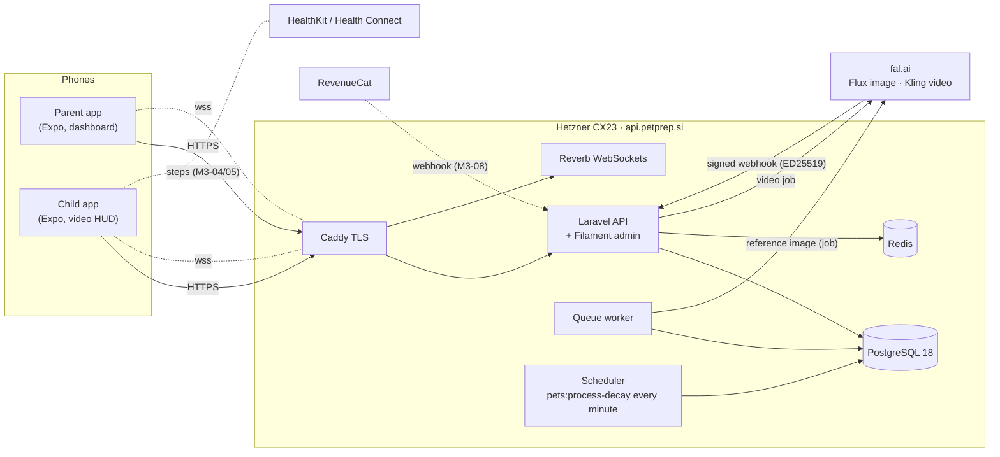
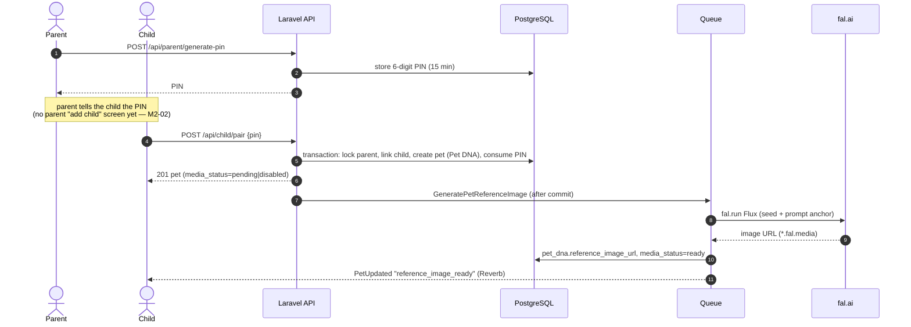
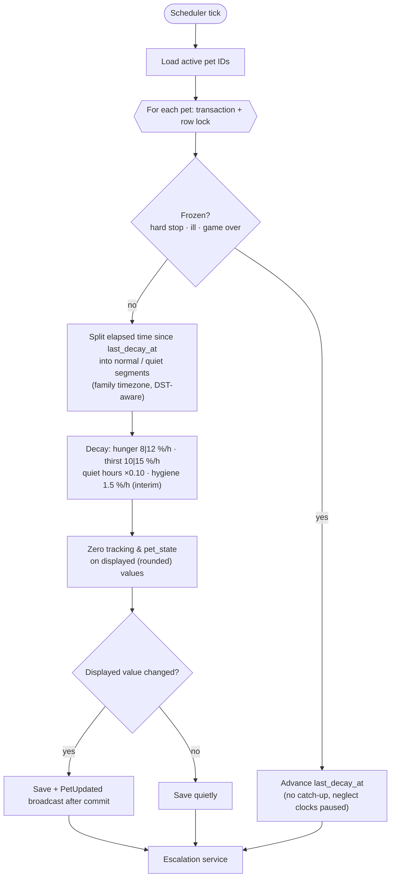
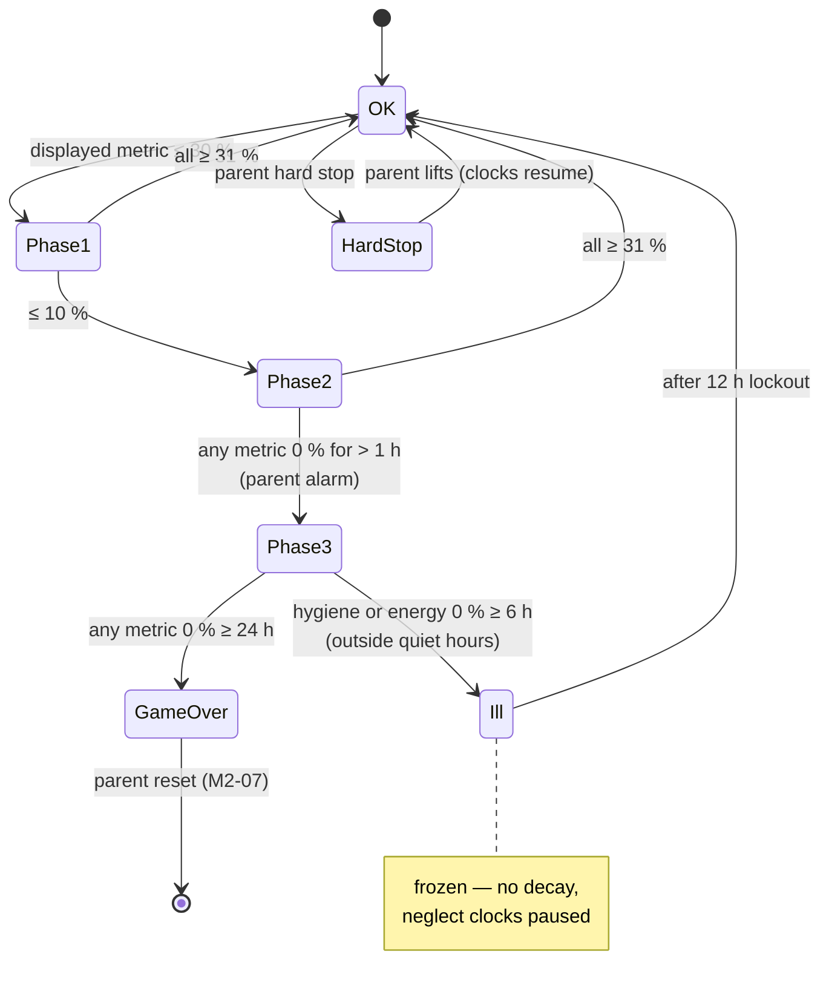
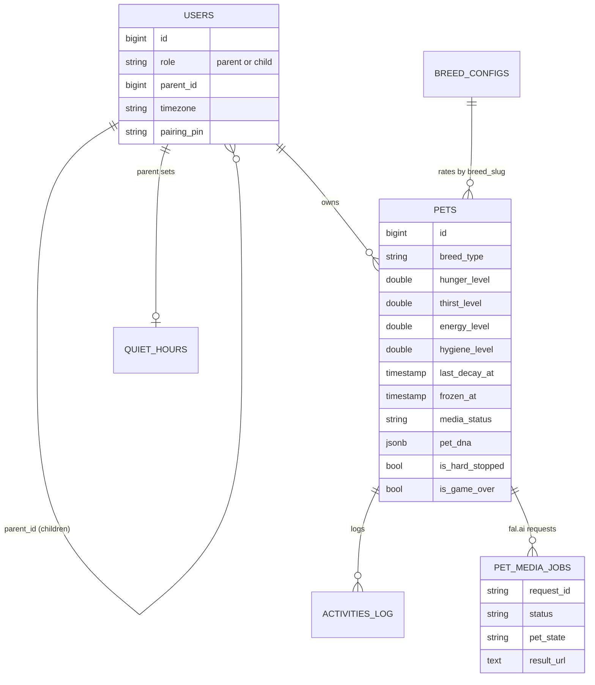
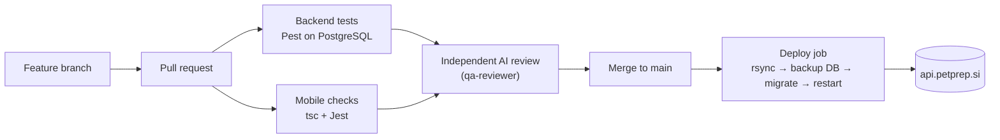

# PetPrep — Diagrams (Mermaid)

Living diagrams of the system **as built**. Update in the same PR as the code. GitHub renders Mermaid natively; export to PNG/SVG for decks with `npx @mermaid-js/mermaid-cli -i DIAGRAMS.md`.

Legend: solid = built and deployed · dashed = planned (roadmap ID in label).

## 1. System context

## 2. Pairing (parent ↔ child)

## 3. Game loop tick (every minute)

## 4. Escalation & neglect

## 5. Data model (core)

## 6. Delivery pipeline

