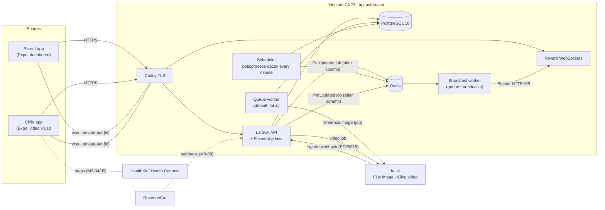
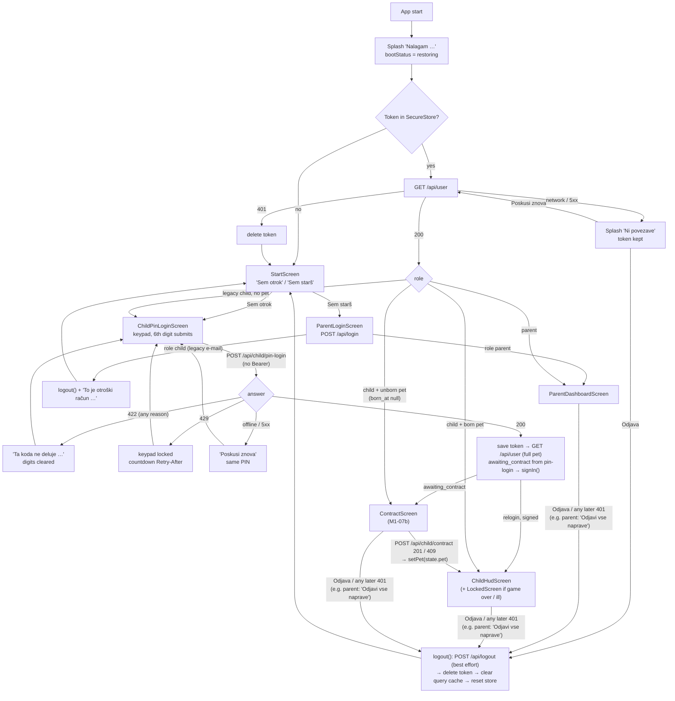
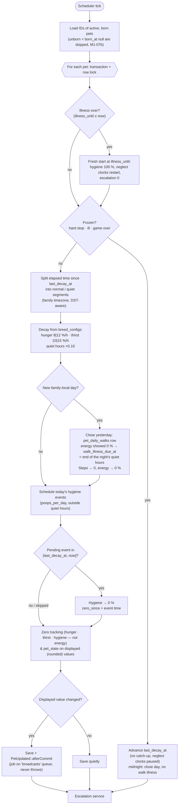
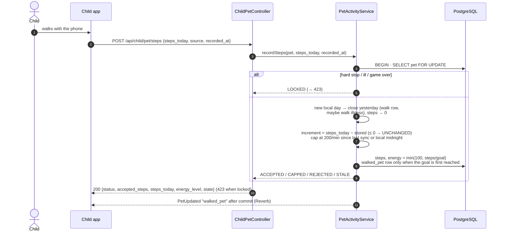
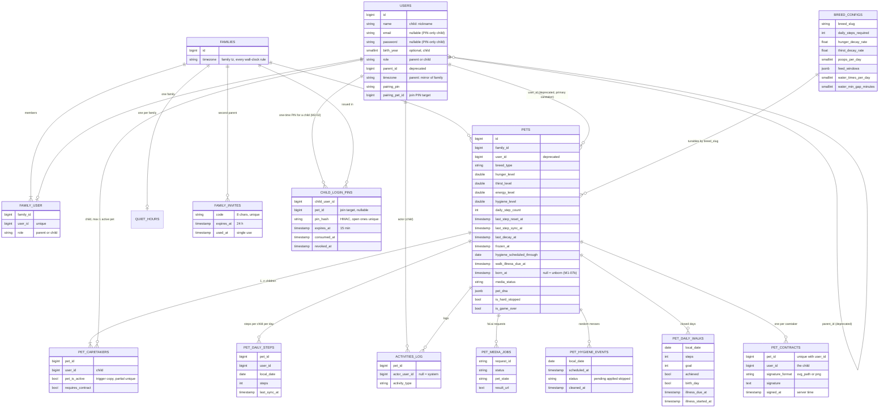
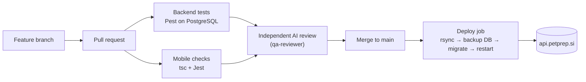
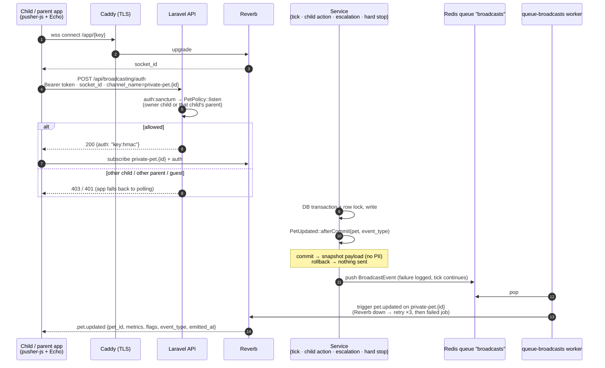

# PetPrep — Diagrams (Mermaid)

Living diagrams of the system **as built**. Update in the same PR as the code. GitHub renders Mermaid natively; export to PNG/SVG for decks with `npx @mermaid-js/mermaid-cli -i DIAGRAMS.md`.

Legend: solid = built and deployed · dashed = planned (roadmap ID in label).

## 1. System context



## 2. Pairing (parent ↔ child) — legacy e-mail child flow (deprecated since M2-02; new profiles: §2c)

```mermaid
sequenceDiagram
  autonumber
  actor Parent
  actor Child
  participant API as Laravel API
  participant DB as PostgreSQL
  participant Q as Queue
  participant FAL as fal.ai
  Note over Parent: "Dodaj otroka" card (dashboard, or Controls)<br/>shown only while no child is paired
  Parent->>API: POST /api/parent/generate-pin (5/min)
  API->>DB: store 6-digit PIN (15 min, replaces the previous one)
  API-->>Parent: PIN → shown as "734 912" + live countdown + "Nova koda"
  Note over Parent,Child: parent tells the child the PIN<br/>(this child already signed in with e-mail — deprecated; PIN-only login: §2c)
  loop every 5 s while the PIN is valid
    Parent->>API: GET /api/parent/dashboard
  end
  Child->>API: POST /api/child/pair {pin}
  API->>DB: transaction: lock parent, link child,<br/>create UNBORN pet (Pet DNA, born_at null), consume PIN
  API-->>Child: 201 pet (born_at null, awaiting_contract, media_status=pending|disabled)
  API->>Q: GeneratePetReferenceImage (after commit)
  Q->>FAL: fal.run Flux (seed + prompt anchor)
  FAL-->>Q: image URL (*.fal.media)
  Q->>DB: pet_dna.reference_image_url, media_status=ready
  Q-->>Child: PetUpdated "reference_image_ready" (Reverb)
  Parent->>API: GET /api/parent/dashboard → pet ≠ null, awaiting_contract
  Note over Parent: "Otrok je povezan!" → GET /api/user refreshes the session pet
  Note over Child,DB: unborn: no decay, hygiene events, day close or escalation;<br/>every child action except the contract → 423 contract_required
  Child->>API: POST /api/child/contract {signature} (Pogodba o odgovornosti)
  API->>DB: transaction: SELECT pet FOR UPDATE, pet_contracts row,<br/>birth: born_at = last_decay_at = last_step_reset_at = now,<br/>metrics 100 %, signed_contract row
  API-->>Child: 201 {status: accepted, state (unlocked)}
  API-->>Parent: PetUpdated "signed_contract" after commit (awaiting_contract false)
  Note over Child,DB: the dog is born — game loop runs from the signing moment (M1-07b)
```

## 2a. Family: second parent and shared pet (M2-01, ADR-012)

```mermaid
sequenceDiagram
  autonumber
  actor Mum as Parent A
  actor Dad as Parent B (new account)
  actor Kid2 as Child 2
  participant API as Laravel API
  participant DB as PostgreSQL
  Mum->>API: POST /api/parent/invite-parent (10/h)
  API->>DB: family_invites: 8-char code, 24 h, single use<br/>(A's previous unused code expires)
  API-->>Mum: 201 {code, expires_at}
  Note over Mum,Dad: code shared outside the app
  Dad->>API: POST /api/parent/join-family {code}
  alt wrong / expired / used code
    API-->>Dad: 422 invalid_code | code_expired | code_used<br/>(5 wrong in 15 min → 429)
  else B already has children or pets
    API-->>Dad: 409 family_not_empty (no merge)
  else ok
    API->>DB: transaction: lock invite, move B into A's family,<br/>delete B's empty family, used_at = now
    API-->>Dad: 200 {family {id, parents, children_count, pets_count}}
  end
  Dad->>API: POST /api/parent/generate-pin {pet_id: Rex}
  API->>DB: PIN on B (15 min), pairing_pet_id = Rex<br/>(Rex must be an active pet of this family, else 422 pet_not_joinable)
  Kid2->>API: POST /api/child/pair {pin}
  API->>DB: transaction: child → family (parent_id mirror = B),<br/>pet_caretakers (Rex, child 2, requires_contract)<br/>partial unique: child has no other active pet
  API-->>Kid2: 201 {joined_existing: true, pet: Rex (born_at unchanged), awaiting_contract: true}
  Kid2->>API: POST /api/child/pet/feed
  API-->>Kid2: 423 contract_required (only for child 2 — child 1 keeps playing)
  Kid2->>API: POST /api/child/contract {signature}
  API->>DB: pet_contracts (Rex, child 2) — no rebirth
  API-->>Kid2: 201 state (unlocked)
  Note over Mum,Kid2: every action stores actor_user_id;<br/>steps per child in pet_daily_steps, the pet's walk = sum;<br/>channel private-pet.{Rex}: both children + both parents
```

## 2b. Mobile app launch — session restore (M1-12) and start screen (M2-02)



Parent side of §2c in the app: `FamilyChildrenCard` / "Dodaj otroka" → `AddChildScreen`: nickname + optional birth year → `POST /api/parent/children` → "Nov pes" / "Pridruži se psu …" → `POST /api/parent/generate-pin {child_id, pet_id?}` → PIN + countdown; dashboard polled every 5 s until the child has a pet or one more device → "Otrok je povezan!".

## 2c. PIN-only child login (M2-02 / M2-03)

```mermaid
sequenceDiagram
  autonumber
  actor Parent
  actor Child as Child (own device, no account)
  participant API as Laravel API
  participant DB as PostgreSQL
  Parent->>API: POST /api/parent/children {display_name, birth_year?}<br/>(token ability parent)
  API->>DB: users row: role child, nickname, birth_year,<br/>email NULL, password NULL; family_user (child)
  API-->>Parent: 201 {child {id, …}}
  Parent->>API: POST /api/parent/generate-pin {child_id, pet_id?}
  API->>DB: lock parent → child → family; mode = new_pet | join_pet | relogin;<br/>revoke the child's open PIN; insert child_login_pins<br/>(HMAC-SHA256 of the PIN, 15 min)
  API-->>Parent: {pin "734 912", expires_at, mode}
  Note over Parent,Child: parent tells the child the PIN
  Child->>API: POST /api/child/pin-login {pin, device_name}<br/>(unauthenticated, 10/min per IP)
  alt locked out (≥ 10 failures from this IP or ≥ 100 overall in 15 min)
    API-->>Child: 429 too_many_attempts + Retry-After
  else no open, unexpired PIN with this HMAC
    API->>API: count failure (per IP + global)
    API-->>Child: 422 invalid_pin (same body for wrong / expired / used)
  else match
    API->>DB: transaction: lock parent → child → family → PIN row, re-check
    alt child never paired
      API->>DB: new_pet: create UNBORN pet + caretaker<br/>join_pet: caretaker of the shared pet (requires_contract)
    else child already a caretaker
      Note over API,DB: relogin: nothing re-paired
    end
    API->>DB: PIN consumed_at; token abilities ["child"];<br/>keep the newest 3 tokens of this child
    API-->>Child: 200 {token, user {id, name, role}, mode, pet, awaiting_contract}
  end
  Child->>API: POST /api/child/contract (Bearer, ability child) → birth (M1-07b)
  Parent->>API: DELETE /api/parent/children/{id}/tokens<br/>(lost phone: all devices signed out, open PIN revoked)
```

Token abilities (M2-03): `/api/parent/*` → `ability:parent`, `/api/child/*` → `ability:child`, then the policies (role + family). Tokens issued before M2-02 carry `*` and pass the ability check; the policies still keep the roles apart.

## 3. Game loop tick (every minute)



## 4. Escalation & neglect

```mermaid
stateDiagram-v2
  [*] --> Unborn: pairing (PIN)
  Unborn --> OK: contract signed = birth<br/>(born_at = now, metrics 100 %)
  note left of Unborn: waiting for the contract —<br/>no decay, no hygiene events,<br/>no day close, no escalation;<br/>actions 423 contract_required
  OK --> Phase1: displayed metric ≤ 30 %<br/>(energy only outside quiet hours)
  Phase1 --> Phase2: ≤ 10 %
  Phase2 --> Phase3: hunger / thirst / hygiene 0 % for > 1 h<br/>(parent alarm — never from energy)
  Phase1 --> OK: all ≥ 31 %
  Phase2 --> OK: all ≥ 31 %
  Phase3 --> Ill: hygiene 0 % ≥ 6 h<br/>(counted outside quiet hours only)
  OK --> Ill: no walk yesterday (energy showed 0 % at midnight)<br/>→ ill from the end of the night's quiet hours
  Ill --> OK: after 12 h lockout<br/>hygiene 100 %, clocks reset (fresh start)
  Phase3 --> GameOver: hunger / thirst / hygiene 0 % ≥ 24 h
  GameOver --> [*]: parent reset (M2-07)
  note right of Ill: frozen — no decay, no hygiene events,<br/>neglect clocks paused, actions refused.<br/>Recovery: hygiene 100 %, every running<br/>neglect clock restarts at recovery,<br/>hunger / thirst unchanged (David 2026-10-03)
  state HardStop
  OK --> HardStop: parent hard stop
  HardStop --> OK: parent lifts (clocks resume)
```

### Daily walk rule (energy, David 2026-10-03)


## 5. Child actions (M1-07: `/api/child/pet/*`, `/api/child/contract`)

### 5a. Feed / water / clean / contract

```mermaid
sequenceDiagram
  autonumber
  actor Child
  participant App as Child app
  participant API as ChildPetController
  participant S as PetActivityService
  participant C as CareScheduleService
  participant DB as PostgreSQL
  Child->>App: taps Feed (or Water / Clean / signs contract)
  App->>API: POST /api/child/pet/feed (Bearer, child token)
  API->>API: ChildPetRequest → PetPolicy (child only, else 403)<br/>currentPet() (none → 404 no_pet)
  API->>S: feed(pet)
  S->>DB: BEGIN · SELECT pet FOR UPDATE
  S->>S: illness over? → fresh start (recoverFromIllnessIfDue)
  alt game over / inactive / hard stop / contract required (unborn) / ill
    S-->>API: LOCKED + reason → 423 {reason, locked_until, state}
  else
    S->>S: catch up decay since last tick (PetDecayService::catchUpLocked)
    alt hygiene shows 0 %
      S-->>API: REFUSED needs_cleaning → 422
    else
      S->>C: feeding(pet, breed, now) — windows in family tz,<br/>last fed_pet row in activities_log
      alt outside window / already fed in this window
        S-->>API: REFUSED + next window start → 422 {reason, next_allowed_at}
      else
        S->>DB: hunger 100 %, hunger_zero_since null, pet_state<br/>fed_pet row (value = hunger before)
        S-->>API: ACCEPTED → 200 {status, state}
      end
    end
  end
  S->>DB: COMMIT
  S-->>App: one PetUpdated after commit ("fed_pet",<br/>or "metric_changed" if only the catch-up changed what shows)
  Note over S,C: Water: same flow, CareScheduleService::water —<br/>water_times_per_day per local day, ≥ water_min_gap_minutes real minutes<br/>since the last refill (also across midnight) → thirst 100 %, watered_pet row
  Note over S,DB: Clean: settles due hygiene events, hygiene 100 %, cleaned_poop row (no window).<br/>Contract: allowed while contract_required; once per pet → pet_contracts row + signed_contract row → 201<br/>(unborn pet: birth in the same transaction, M1-07b); again → 409
```

### 5b. Step sync



### 5c. Child app: action ↔ cache ↔ Reverb (M1-13 / M1-14 / M1-15 / M1-16)

```mermaid
sequenceDiagram
  autonumber
  actor Child
  participant HUD as ChildHudScreen
  participant Q as TanStack cache ['child','pet']
  participant API as Laravel API
  participant Rev as Reverb (private-pet.{id})
  participant Store as appStore (lock / contract)

  HUD->>API: GET /api/child/pet (useChildPet)
  API-->>Q: state → normalizeChildState (server_time)
  Note over HUD,Rev: wsStatus ≠ connected (not subscribed yet / dropped / 403)<br/>→ refetch every 10 s; connected → no polling
  Child->>HUD: taps Hrani (enabled only if feeding.can_feed)
  HUD->>Q: cancel in-flight GET · optimistic hunger 100 %
  HUD->>API: POST /api/child/pet/feed
  alt 200 accepted / unchanged
    API-->>Q: replace with response.state · toast "Njam! Kuža je sit."
  else 422 refused (outside_feed_window, water_too_soon, needs_cleaning …)
    API-->>Q: replace with error.state (rollback) · toast "Kuža bo lačen spet ob 17:00."<br/>(next_allowed_at in state.timezone)
  else 423 locked (hard_stopped / ill / game_over / inactive / contract_required)
    API-->>Q: replace with error.state
  else offline / 5xx / 429 (no state)
    HUD->>Q: restore previous view · toast "Ni povezave …"
  end
  Rev-->>HUD: .pet.updated {…, emitted_at}
  HUD->>Q: applyBroadcast — drop if emitted_at < last emitted / snapshot;<br/>else metrics + lock flags; non-tick or lock change → refetch GET
  Q-->>Store: lockStateFromView → setLockState(hard_stop | illness | game_over | inactive, until, tz)<br/>awaiting_contract → setAwaitingContract(true)
  Store-->>HUD: AppNavigator: LockedScreen over the HUD (unlocks live) · ContractScreen instead of the HUD
  Note over HUD,Q: timer at the earliest of next window start, current window end,<br/>water next_allowed_at, next family midnight → refetch GET (also while live)
  loop on mount (permission granted), on foreground, every 5 min, on walk overlay close
    HUD->>API: POST /api/child/pet/steps {steps_today, source: pedometer, recorded_at ±HH:MM}<br/>(iOS: CoreMotion since the FAMILY midnight · Android: live counter per child, family day) — only if > my_steps_today of that family day
    API-->>Q: replace with response.state (any status; 423 too)
  end
```

## 6. Data model (core)

Family model (M2-01, ADR-012): `families` own pets and quiet hours; `family_user` puts parents and children in a family; `pet_caretakers` links children to pets (shared pet = several rows). `users.parent_id` and `pets.user_id` are deprecated mirrors.



## 7. Delivery pipeline



## 8. Real-time delivery (M1-08 private channel, M1-09 queue)


